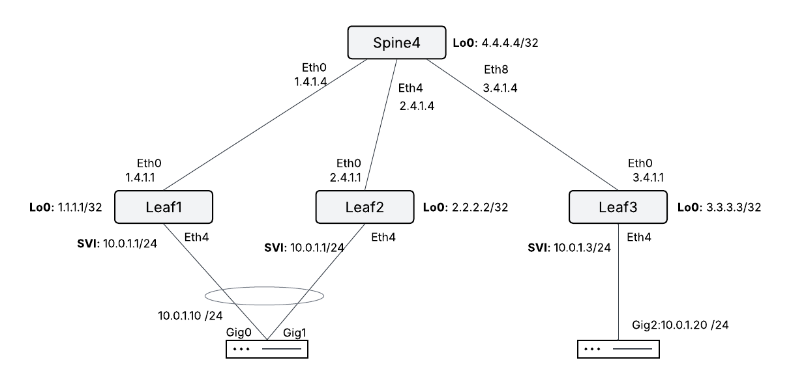
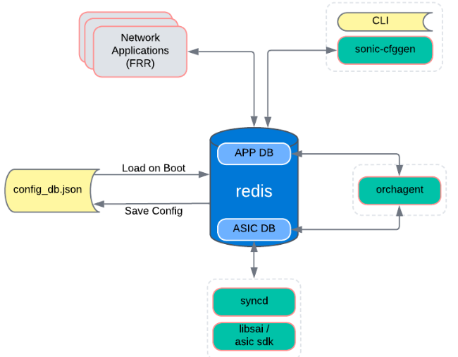

# Introduction to SONiC & SONiC Configuration
## Lab 1 — 3-Leaf / 1-Spine

---

## Introduction

This lab introduces the SONiC (Software for Open Networking in the Cloud) network operating system. You will explore the SONiC environment hands-on — login experience, software versioning, Docker-based architecture, platform hardware monitoring, and the three configuration methods (CLI, JSON, and FRR/vtysh). Then you will configure basic networking primitives. By the end of this lab you will have a solid foundation for subsequent labs that build eBGP underlay and VXLAN EVPN overlay fabrics.

**SONiC version used in this lab:** SONiC.202405cz.2.2.2 (Cisco 8000, FRR 8.5.4)

---

## Table of Contents
  - [Lab Objectives](#lab-objectives)
  - [Topology](#topology)
  - [Task 1 — SONiC Hello World](#task-1--sonic-hello-world)
    - [1.1 Login Banner \& First Look](#11-login-banner--first-look)
    - [1.2 Versions \& Image Management](#12-versions--image-management)
    - [1.3 Platform Hardware](#13-platform-hardware)
    - [1.4 Docker Containers \& Services](#14-docker-containers--services)
    - [1.5 Configuration Methods](#15-configuration-methods)
      - [1.5.1 CLI (`sudo config`)](#151-cli-sudo-config)
      - [1.5.2 JSON (`config_db.json`)](#152-json-config_dbjson)
      - [1.5.3 FRR (vtysh)](#153-frr-vtysh)
    - [1.6 Reboot Mechanisms](#16-reboot-mechanisms)
    - [1.7 vXR Emulation Brief](#17-vxr-emulation-brief)
  - [Task 2 — Basic Configuration Circuit](#task-2--basic-configuration-circuit)
    - [2.1 Configuring Users](#21-configuring-users)
    - [2.2 Configuring Interface IPv4](#22-configuring-interface-ipv4)
    - [2.3 Configuring Loopback Interface](#23-configuring-loopback-interface)
    - [2.4 Configuring VLANs](#24-configuring-vlans)
      - [Access Port (Untagged)](#access-port-untagged)
      - [Trunk Port (Tagged)](#trunk-port-tagged)
      - [Cleanup (reference)](#cleanup-reference)
    - [2.5 VLAN SVI (Switched Virtual Interface)](#25-vlan-svi-switched-virtual-interface)
    - [2.6 PortChannel (LACP)](#26-portchannel-lacp)
    - [2.7 Configuring MTU](#27-configuring-mtu)
    - [2.8 VRF Configuration](#28-vrf-configuration)
      - [Create VRFs](#create-vrfs)
      - [Bind Interfaces to a VRF](#bind-interfaces-to-a-vrf)
      - [Unbind an Interface](#unbind-an-interface)
      - [Delete a VRF](#delete-a-vrf)
    - [2.9 Static Routes](#29-static-routes)
    - [2.10 NTP Configuration](#210-ntp-configuration)
    - [2.11 Syslog Configuration](#211-syslog-configuration)
    - [2.12 Configuration Management](#212-configuration-management)
      - [Running vs Startup Configuration](#running-vs-startup-configuration)
      - [config save — Running to Disk](#config-save--running-to-disk)
      - [config load — Merge JSON into Running](#config-load--merge-json-into-running)
      - [config reload — Full Replace (Day 0 / Config Replace)](#config-reload--full-replace-day-0--config-replace)
      - [config apply-patch — Surgical JSON Patch](#config-apply-patch--surgical-json-patch)
      - [Summary](#summary)
      - [FRR Configuration Persistence](#frr-configuration-persistence)
      - [A Primer on REDIS Commands](#a-primer-on-redis-commands)
      - [REDIS Database IDs](#redis-database-ids)
      - [Querying CONFIG\_DB](#querying-config_db)
  - [End of Lab 1](#end-of-lab-1)

---

## Lab Objectives

By completing this lab you will be able to:

- [ ] Explore the SONiC login experience, CLI help, and software versions
- [ ] Query platform hardware: inventory, temperatures, PSUs, fans, EEPROM
- [ ] Inspect Docker containers, manage them via systemctl, and toggle SONiC features
- [ ] Identify the three configuration methods: CLI, JSON, and FRR/vtysh
- [ ] Explain reboot strategies and image management
- [ ] Configure IPv4 addresses on physical interfaces and loopback interfaces
- [ ] Create VLANs (access and trunk), SVIs, PortChannels, VRFs, and static routes
- [ ] Configure MTU, NTP, and remote syslog
- [ ] Save, load, and reload configuration; query the REDIS database directly

---

## Topology

For Labs 1-6 you will be using a single topology as outlined below. We will have four SONiC routers running in a two tier fabric with host containers connected to each leaf. 




## Task 1 — SONiC Hello World

> **Goal:** Get familiar with the SONiC environment before configuring anything. Run commands, read outputs, and build mental models for how SONiC works.
>
> All commands in Task 1 are run on **Leaf1**.

---

### 1.1 Login Banner & First Look

SSH into Leaf1. You land in a standard Debian Linux shell with the SONiC banner:

```
You are on
  ____   ___  _   _ _  ____
 / ___| / _ \| \ | (_)/ ___|
 \___ \| | | |  \| | | |
  ___) | |_| | |\  | | |___
 |____/ \___/|_| \_|_|\____|

-- Software for Open Networking in the Cloud --

Unauthorized access and/or use are prohibited.
All access and/or use are subject to monitoring.

Help:    https://sonic-net.github.io/SONiC/
```

SONiC is a full Linux distribution — you have `bash`, `apt`, `python3`, `docker`, and all standard Linux utilities alongside the SONiC CLI.

**Run** — Check what *SONiC* CLI commands are available:

```bash
show --help
```

You will see the full list of `show` subcommands — `version`, `interfaces`, `vlan`, `ip`, `platform`, `lldp`, and many more. Browse through them to see the breadth of SONiC's CLI.

**Run** — Check what `config` subcommands are available:

```bash
sudo config --help
```

This shows the configuration counterpart — `interface`, `vlan`, `vrf`, `route`, `portchannel`, `ntp`, `syslog`, etc.

> **Permissions:** `show` commands can be run by any user. All `config` commands require `sudo` (root privileges). This is a fundamental SONiC convention — read is open, write is protected.

**Run** — Check the system uptime:

```bash
show uptime
```

```
up 5 days, 21 hours, 58 minutes
```

---

### 1.2 Versions & Image Management

**Run** — Identify the running software:

```bash
show version
```

```
SONiC Software Version: SONiC.202405cz.2.2.2
SONiC OS Version: 12
Distribution: Debian 12.13
Kernel: 6.1.0-11-2-amd64
Build commit: b0e9485bd
Build date: Thu Mar  5 08:32:57 UTC 2026
Built by: sonicci@sonic-rtp-1-lnx.cisco.com

Platform: x86_64-8102_64h_o-r0
HwSKU: Cisco-8102-C64
ASIC: cisco-8000
ASIC Count: 1
Serial Number: CSNDPBZWVPL
Model Number: 8102-64H-O
Hardware Revision: 0.20
Uptime: 03:52:10 up 5 days, 21:40,  0 user,  load average: 2.30, 2.25, 2.24
Date: Sun 19 Apr 2026 03:52:10

Docker images:
REPOSITORY                    TAG              IMAGE ID       SIZE
docker-orchagent              202405cz.2.2.2   182a7e9af168   385MB
docker-fpm-frr                202405cz.2.2.2   86b8f513c3bf   404MB
docker-syncd-cisco            202405cz.2.2.2   a779101f92fb   1.11GB
docker-database               202405cz.2.2.2   8e5e3e655964   350MB
...
```

Key fields to note:
- **SONiC Software Version** — the full image version string
- **Platform** — the ONIE platform identifier (maps to a specific hardware model)
- **HwSKU** — the hardware SKU (determines port layout and forwarding capacity)
- **ASIC** — the forwarding chip family (`cisco-8000`, `broadcom`, `mellanox`, etc.)
- **Docker images** — each SONiC subsystem is a Docker container; `docker-syncd-cisco` contains the Cisco 8000 SDK and SAI

SONiC builds a **single binary image per ASIC platform** — the same `cisco-8000` image runs on an 8102-64H, 8111-32EH, or 8201-32FH. The HwSKU determines which port map and platform drivers are loaded at boot.

Every SONiC image bundles three critical components:

| Component | What it does |
|-----------|-------------|
| **SONiC** | The NOS — Linux, containers, CLI, config infrastructure |
| **SAI (Switch Abstraction Interface)** | Vendor-neutral API that SONiC uses to program the ASIC |
| **SDK** | Vendor-specific code that translates SAI calls to ASIC hardware registers |

The SDK and SAI versions are locked to the image — you cannot upgrade them independently.

**Run** — SONiC supports dual image. Check what's installed:

```bash
sudo sonic-installer list
```

```
Current: SONiC-OS-202405cz.2.2.2
Next: SONiC-OS-202405cz.2.2.2
Available:
SONiC-OS-202405cz.2.2.2
```

- **Current** — the image the system booted from
- **Next** — the image that will be used on next reboot
- **Available** — all images installed on disk

You can install a second image with `sonic-installer install` and toggle between them with `sonic-installer set-default`.

---

### 1.3 Platform Hardware

SONiC provides rich hardware visibility. These commands are read-only — safe to run any time.

**Run** — Compact platform summary:

```bash
show platform summary
```

```
Platform: x86_64-8102_64h_o-r0
HwSKU: Cisco-8102-C64
ASIC: cisco-8000
ASIC Count: 1
Serial Number: CSNDPBZWVPL
Model Number: 8102-64H-O
Hardware Revision: 0.20
```

**Run** — Full chassis inventory (chassis, route processors, PSUs, fans, FPDs):

```bash
show platform inventory
```

```
    Name                Product ID      Version        Serial Number   Description

Chassis
    CHASSIS             8102-64H-O      0.20           CSNDPBZWVPL     Cisco 8102 2RU System with SONiC and 64x100GE QSFP28

Route Processors
    RP                  8102-64H-O      0.20           PCBDPBZWVPN     Cisco 8102 2RU System with SONiC and 64x100GE QSFP28

Power Supplies
    psutray
        PSU0 -- not present
        PSU1 -- not present

Cooling Devices
    fantray0 -- not present
    fantray1 -- not present
    fantray2 -- not present

FPDs
    RP/iofpga                           0.1.1-0                        IOFPGA
    RP/valentine                        0.24.0-0                       VALENTINE
```

> PSUs and fans show "not present" because this is a vXR emulated device. On physical hardware, you would see model numbers, serial numbers, voltage/current readings, and fan speeds.

**Run** — System EEPROM (hardware identity programmed at factory):

```bash
show platform syseeprom
```

```
TlvInfo Header:
   Id String:    TlvInfo
   Version:      1
   Total Length: 94
TLV Name             Code      Len  Value
-------------------  ------  -----  --------------------
Product Name         0x21       10  8102-64H-O
Part Number          0x22        6  ECI123
Serial Number        0x23       11  CSNDPBZWVPL
Base MAC Address     0x24        6  78:61:2F:F8:9C:00
Device Version       0x26        1  0
Platform Name        0x28       20  x86_64-8102_64h_o-r0
MAC Addresses        0x2A        2  516
Manufacturer         0x2B        5  Cisco
Manufacture Country  0x2C        2  US
Vendor Name          0x2D        5  Cisco
CRC-32               0xFE        4  0x91DC628F

(checksum valid)
```

This is the ONIE TLV EEPROM — it stores the base MAC address, serial number, platform name, and manufacturer info. SONiC reads this at boot to determine which platform drivers and HwSKU to load.

**Run** — Temperature sensors:

```bash
show platform temperature
```

```
                    Sensor    Temperature    High TH    Low TH    Crit High TH    Crit Low TH    Warning          Timestamp
--------------------------  -------------  ---------  --------  --------------  -------------  ---------  -----------------
           ADT75_FANB_TEMP           25.0       75.0     -10.0            80.0          -15.0      False  20260419 04:01:23
     MB_U1_GB_CORE_L1_TEMP           32.0      115.0      -8.0           125.0          -10.0      False  20260419 04:01:23
 MB_U113_TMP421_LOCAL_TEMP           25.0       50.0     -10.0            55.0          -15.0      False  20260419 04:01:23
MB_U113_TMP421_REMOTE_TEMP           25.0       50.0     -10.0            55.0          -15.0      False  20260419 04:01:23
               NPU0_TEMP_0           35.0       97.0      -5.0           102.0          -10.0      False  20260419 04:01:23
               NPU0_TEMP_1           35.0       97.0      -5.0           102.0          -10.0      False  20260419 04:01:23
                       ...
```

Each sensor has threshold values (High, Critical High, Low, Critical Low). The `Warning` column turns `True` when a threshold is exceeded. `NPU0_TEMP_*` sensors are the ASIC die temperatures — the most critical ones to monitor. The `pmon` container continuously polls these sensors and can trigger alarms or shutdown.

**Run** — PSU status:

```bash
show platform psustatus
```

```
PSU    Model    Serial    HW Rev    Voltage (V)    Current (A)    Power (W)    Status       LED
-----  -------  --------  --------  -------------  -------------  -----------  -----------  -----
PSU 1  N/A      N/A       N/A       N/A            N/A            N/A          NOT PRESENT  N/A
PSU 2  N/A      N/A       N/A       N/A            N/A            N/A          NOT PRESENT  N/A
```

**Run** — Fan status:

```bash
show platform fan
```

```
  Drawer    LED            FAN    Speed    Direction     Presence    Status          Timestamp
--------  -----  -------------  -------  -----------  -----------  --------  -----------------
     N/A    N/A      PSU0.fan0      N/A          N/A  Not Present       N/A  20260419 04:01:23
     N/A    N/A      PSU1.fan0      N/A          N/A  Not Present       N/A  20260419 04:01:23
fantray0    N/A  fantray0.fan0      N/A          N/A  Not Present       N/A  20260419 04:01:23
fantray0    N/A  fantray0.fan1      N/A          N/A  Not Present       N/A  20260419 04:01:23
fantray1    N/A  fantray1.fan0      N/A          N/A  Not Present       N/A  20260419 04:01:23
fantray1    N/A  fantray1.fan1      N/A          N/A  Not Present       N/A  20260419 04:01:23
fantray2    N/A  fantray2.fan0      N/A          N/A  Not Present       N/A  20260419 04:01:23
fantray2    N/A  fantray2.fan1      N/A          N/A  Not Present       N/A  20260419 04:01:23
```

> On physical hardware, you would see fan speeds (RPM), airflow direction (front-to-back or back-to-front), and LED status.

**Run** — System memory:

```bash
show system-memory
```

```
               total        used        free      shared  buff/cache   available
Mem:            7487        4376         665           3        2767        3111
Swap:              0           0           0
```

**Run** — All available `show platform` subcommands:

```bash
show platform --help
```

```
Commands:
  current       Show device current information
  fabric        Show platform fabric
  fan           Show fan status information
  firmware      Show firmware information
  idprom        Show Platform Idprom Inventory
  inventory     Show Platform inventory
  npu           Show NPU
  pcieinfo      Show Device PCIe Info
  psustatus     Show PSU status information
  security      Display platform info
  ssdhealth     Show SSD Health information
  summary       Show hardware platform information
  syseeprom     Show system EEPROM information
  temperature   Show device temperature information
  versions
  voltage       Show device voltage information
```

---

### 1.4 Docker Containers & Services

SONiC's architecture is built on Docker. Each major subsystem runs as an isolated container.

**Run** — List running containers:

```bash
docker ps
```

```
CONTAINER ID   IMAGE                                COMMAND                  CREATED      STATUS      NAMES
f6ac22b79632   docker-snmp:latest                   "/usr/local/bin/supe…"   6 days ago   Up 6 days   snmp
c8e746a1960f   docker-platform-monitor:latest       "/usr/bin/docker_ini…"   6 days ago   Up 6 days   pmon
eb2cc79b8b25   docker-sonic-mgmt-framework:latest   "/usr/local/bin/supe…"   6 days ago   Up 6 days   mgmt-framework
e88829357ae1   docker-lldp:latest                   "/usr/bin/docker-lld…"   6 days ago   Up 6 days   lldp
257529d315c1   docker-sonic-gnmi:latest             "/usr/local/bin/supe…"   6 days ago   Up 6 days   gnmi
7c4896c7bd4e   docker-stp:latest                    "/usr/local/bin/supe…"   6 days ago   Up 6 days   stp
76f6134ca7df   docker-router-advertiser:latest      "/usr/bin/docker-ini…"   6 days ago   Up 6 days   radv
413dc0ed88ae   docker-syncd-cisco:latest            "/usr/local/bin/supe…"   6 days ago   Up 6 days   syncd
c5e313517a96   docker-fpm-frr:latest                "/usr/bin/docker_ini…"   6 days ago   Up 6 days   bgp
c5dcf552656b   docker-teamd:latest                  "/usr/local/bin/supe…"   6 days ago   Up 6 days   teamd
3fb624125629   docker-apm:latest                    "/usr/bin/docker-apm…"   6 days ago   Up 6 days   apm
8c752f506054   docker-orchagent:latest              "/usr/bin/docker-ini…"   6 days ago   Up 6 days   swss
2b61106ab9a7   docker-eventd:latest                 "/usr/local/bin/supe…"   6 days ago   Up 6 days   eventd
70db69d5b600   docker-database:latest               "/usr/local/bin/dock…"   6 days ago   Up 6 days   database
```

Key containers:

| Container | Image | Role |
|-----------|-------|------|
| **database** | docker-database | REDIS server — CONFIG_DB, APPL_DB, ASIC_DB, STATE_DB |
| **swss** | docker-orchagent | Switch State Service (orchagent) — translates config into SAI calls |
| **syncd** | docker-syncd-cisco | SAI/SDK daemon — programs the ASIC hardware |
| **bgp** | docker-fpm-frr | FRR routing suite (BGP, OSPF, static routes) |
| **teamd** | docker-teamd | LACP / PortChannel management |
| **lldp** | docker-lldp | Link Layer Discovery Protocol |
| **pmon** | docker-platform-monitor | Platform monitor (fans, PSUs, thermals, transceivers) |
| **gnmi** | docker-sonic-gnmi | gNMI/telemetry server |

Every container is managed by systemd. You can use standard `systemctl` commands:

**Run** — Check the BGP container service status:

```bash
sudo systemctl status bgp --no-pager
```

```
● bgp.service - BGP container
     Loaded: loaded (/lib/systemd/system/bgp.service; enabled; preset: enabled)
    Drop-In: /etc/systemd/system/bgp.service.d
             └─auto_restart.conf
     Active: active (running) since Mon 2026-04-13 06:14:00 UTC; 5 days ago
   Main PID: 4468 (bgp.sh)
      Tasks: 3 (limit: 8937)
     Memory: 29.3M
```

Common operations (reference — do not run now):
```
sudo systemctl restart <service>       # restart a container
sudo systemctl stop <service>          # stop a container
sudo systemctl start <service>         # start it again
```

SONiC also has a **feature management system** that controls which containers are enabled at all.

**Run** — Check feature status:

```bash
show feature status
```

```
Feature           State              AutoRestart     SetOwner
--------------    ---------------    --------------  ----------
apm               enabled            enabled
bgp               enabled            enabled
database          always_enabled     always_enabled
dhcp_relay        disabled           enabled         local
eventd            enabled            enabled
gnmi              enabled            enabled
lldp              enabled            enabled
macsec            disabled           enabled         local
mgmt-framework    enabled            enabled
mux               always_disabled    enabled
nat               disabled           enabled
pmon              enabled            enabled
radv              enabled            enabled
sflow             disabled           enabled
snmp              enabled            enabled
stp               enabled            enabled
swss              enabled            enabled
syncd             enabled            enabled
teamd             enabled            enabled
```

- `enabled` — container is running and starts on boot
- `disabled` — container is stopped and won't start on boot
- `always_enabled` — critical service, cannot be disabled (e.g., `database`)
- `always_disabled` — feature not applicable to this platform

To enable/disable a feature (reference — do not run now):
```
sudo config feature state <feature> enabled
sudo config feature state <feature> disabled
```

**Run** — See who Leaf1's LLDP neighbors are:

```bash
show lldp neighbors
```

```
LLDP neighbors:
-------------------------------------------------------------------------------
Interface:    Ethernet0, via: LLDP, RID: 3, Time: 5 days, 21:48:40
  Chassis:
    ChassisID:    mac 00:a0:0d:00:00:04
    SysName:      pod13-spine4
    SysDescr:     SONiC Software Version: SONiC.202405cz.2.2.2 - HwSku: Cisco-8102-C64 - Distribution: Debian 12.13 - Kernel: 6.1.0-11-2-amd64
    MgmtIP:       192.168.122.74
    Capability:   Bridge, on
    Capability:   Router, on
  Port:
    PortID:       local etp0
    PortDescr:    Ethernet0
    TTL:          120
```

LLDP automatically discovers neighbors. Here we can see Spine4 connected on Ethernet0 — confirming our topology is wired correctly.

**Run** — Look at all interface status:

```bash
show interfaces status
```

```
  Interface                Lanes    Speed    MTU    FEC    Alias    Vlan    Oper    Admin             Type    Asym PFC
-----------  -------------------  -------  -----  -----  -------  ------  ------  -------  ---------------  ----------
  Ethernet0  2304,2305,2306,2307     100G   9100    N/A     etp0  routed      up       up  QSFP28 or later         N/A
  Ethernet4  2308,2309,2310,2311     100G   9100    N/A     etp1  routed      up       up  QSFP28 or later         N/A
  Ethernet8  2320,2321,2322,2323     100G   9100    N/A     etp2  routed      up       up  QSFP28 or later         N/A
 Ethernet12  2324,2325,2326,2327     100G   9100    N/A     etp3  routed      up       up  QSFP28 or later         N/A
 Ethernet16  2312,2313,2314,2315     100G   9100    N/A     etp4  routed      up       up  QSFP28 or later         N/A
 Ethernet20  2316,2317,2318,2319     100G   9100    N/A     etp5  routed      up       up  QSFP28 or later         N/A
 Ethernet24  2056,2057,2058,2059     100G   9100    N/A     etp6  routed      up       up  QSFP28 or later         N/A
 Ethernet28  2060,2061,2062,2063     100G   9100    N/A     etp7  routed      up       up  QSFP28 or later         N/A
         ...
Ethernet252      532,533,534,535     100G   9100    N/A    etp63  routed      up       up  QSFP28 or later         N/A
```

This device has 64x 100GE ports (Ethernet0 through Ethernet252, in steps of 4). Note the `Alias` column — `etp0` through `etp63` are the front-panel port labels. The default MTU is 9100 (jumbo frames) and all ports default to `routed` mode.

>\* **Note:** EthernetX port numbering and counts depend on hardware SKU. SONiC accounts for the SerDes lane on each physical interace. For example the 8122-64H-O platform is numbered in steps of 4. Each 100G interface on the platform has 4 x 25G SerDes which is accounted for in the Lanes column. So each interface increments in steps of 4. 

---

### 1.5 Configuration Methods

SONiC has three ways to push configuration. This section introduces them briefly — we cover the full config lifecycle (save, load, reload, REDIS queries) in detail in [Section 2.12](#212-configuration-management).

#### 1.5.1 CLI (`sudo config`)

The `sudo config ...` commands modify the **running configuration** in REDIS (CONFIG_DB) immediately. This is the primary method for SONiC-native features like interfaces, VLANs, VRFs, and platform settings.

Example (reference — we will run these in Task 2):
```
sudo config interface ip add <interface> <ip/mask>
sudo config vlan add <vlan-id>
sudo config vrf add <vrf-name>
```

Changes take effect instantly but are **not saved to disk** until you run `sudo config save -y`.




#### 1.5.2 JSON (`config_db.json`)

All SONiC configuration can be expressed as JSON. The startup config file is `/etc/sonic/config_db.json`. You can load JSON snippets into the running config or replace the entire config from a file. Full details on `config save`, `config load`, `config reload`, and `config apply-patch` are in [Section 2.12](#212-configuration-management).

#### 1.5.3 FRR (vtysh)

Routing protocols (BGP, OSPF, etc.) are configured inside the FRR container via `vtysh`. FRR maintains its **own** configuration state, separate from CONFIG_DB:

- SONiC-native config (interfaces, VLANs, VRFs, etc.) -> CONFIG_DB -> `config_db.json`
- Routing config (BGP, OSPF, route-maps, etc.) -> FRR -> `frr.conf` (inside the BGP container)

When you `config save`, only CONFIG_DB is written to disk. FRR config is saved separately with `write mem` inside vtysh.

**Run** — Enter the FRR CLI:

```bash
vtysh
```

```
Hello, this is FRRouting (version 8.5.4).
Copyright 1996-2005 Kunihiro Ishiguro, et al.

pod13-leaf1#
```

**Run** — Check the FRR version (from inside vtysh):

```
pod13-leaf1# show version
```

```
FRRouting 8.5.4 (pod13-leaf1) on Linux(6.1.0-11-2-amd64).
```

**Run** — Exit vtysh:

```
pod13-leaf1# exit
```

The routing config mode on this device is `split-unified` — FRR configuration is managed by FRR config files inside the BGP container, while SONiC-native config stays in CONFIG_DB. Both are managed independently. We will use `vtysh` extensively in the BGP and EVPN labs.

---

### 1.6 Reboot Mechanisms

SONiC supports several reboot strategies with different trade-offs:

| Reboot Type | Command | Downtime | Description |
|-------------|---------|----------|-------------|
| Cold reboot | `sudo reboot` | Full | All services restart, full convergence required |
| Fast reboot | `sudo fast-reboot` | ~30s | Dataplane stays up briefly; control plane restarts |
| Warm reboot | `sudo warm-reboot` | Minimal | Dataplane and most state preserved; hitless for forwarding |
| Express reboot * | `sudo express-reboot` | Sub-second | NPU state saved/restored via DMA; control plane follows warm-reboot flow |

**Express Boot** saves the NPU (ASIC) table configuration before reboot and restores it via DMA after the new image boots, skipping the normal syncd reconciliation step. The control plane follows the same warm-reboot procedure — BGP sessions are preserved via graceful restart. The result is sub-second traffic interruption.

> \* **Platform dependency:** `warm-reboot`, `fast-reboot`, and `express-reboot` support depends on platform and ASIC. Express Boot currently requires Cisco 8000 series hardware with SDK-level support.

---

### 1.7 vXR Emulation Brief

This lab uses **vXR** (Cisco 8000 Emulator), which runs the same `docker-syncd-cisco` container and SDK as real hardware. Platform-specific commands like `show platform inventory` and `show platform temperature` work identically to production.

Other virtualized SONiC options include:

| Option | Dataplane | Fidelity | Use Case |
|--------|-----------|----------|----------|
| **SONiC-VS** | Linux kernel forwarding | Low | Basic CI/CD testing, control plane dev |
| **SONiC VPP** | VPP (Vector Packet Processing) | Medium | Functional testing without hardware |
| **vXR** | Emulated Cisco 8000 ASIC via SDK | High | Full-fidelity lab that mirrors production |

Topology orchestration options:

| Tool | Description |
|------|-------------|
| **pyvxr** | Python library for programmatic vXR topology management |
| **containerlab** | Open-source tool for container-based network labs |
| **CML (Cisco Modeling Labs)** | GUI-driven lab platform with vXR support |

> \* **Note:**: containerlab can also support sonic-vs kvm images with the help of a conversion tool called vrnetlab. If interested ask instructors for details.

---

## Task 2 — Basic Configuration Circuit

> **Goal:** Configure fundamental device settings on Leaf1 — users, interface IPs, loopback addresses, VLANs, PortChannels, VRFs, and more.
>
> All commands in Task 2 are run on **Leaf1** only.

---

### 2.1 Configuring Users

SONiC uses standard Linux user management. The default user is `admin`.

**Run:**

```bash
sudo useradd -m -s /bin/bash labuser
sudo passwd labuser
```

To add the user to the sudo group:

**Run:**

```bash
sudo usermod -aG sudo labuser
```

**Verify:**

```bash
cat /etc/passwd | grep labuser
```

---

### 2.2 Configuring Interface IPv4

**Run:**

```bash
sudo config interface ip add Ethernet0 1.4.1.1/24
```

**Verify:**

```bash
show ip interfaces
```

```
Interface    Master    IPv4 address/mask    Admin/Oper    BGP Neighbor    Neighbor IP
-----------  --------  -------------------  ------------  --------------  -------------
Ethernet0              1.4.1.1/24           up/up         N/A             N/A
Loopback0              1.1.1.1/32           up/up         N/A             N/A
docker0                240.127.1.1/24       up/down       N/A             N/A
eth0                   192.168.122.71/24    up/up         N/A             N/A
eth4                   192.168.123.134/24   up/up         N/A             N/A
lo                     127.0.0.1/16         up/up         N/A             N/A
```

Ethernet0 shows `1.4.1.1/24` with `up/up` status. The `eth0` and `eth4` interfaces are management — do not modify them.

**Linux view** — SONiC programs the Linux kernel. You can see the same IP with standard `ip` commands:

```bash
ip addr show Ethernet0
```

```
57: Ethernet0: <BROADCAST,MULTICAST,UP,LOWER_UP> mtu 9100 qdisc fq_codel state UNKNOWN group default qlen 1000
    link/ether 78:2f:16:35:b0:00 brd ff:ff:ff:ff:ff:ff
    inet 1.4.1.1/24 brd 1.4.1.255 scope global Ethernet0
       valid_lft forever preferred_lft forever
    inet6 fe80::7a2f:16ff:fe35:b000/64 scope link
       valid_lft forever preferred_lft forever
```

Every `sudo config interface ip add` command writes to CONFIG_DB, which orchagent translates into both a SAI call (to program the ASIC) and a kernel netlink update (so Linux routing works too).

---

### 2.3 Configuring Loopback Interface

**Run:**

```bash
sudo config interface ip add Loopback0 1.1.1.1/32
```

**Verify:**

```bash
show ip interfaces | grep Loopback
```

```
Loopback0              1.1.1.1/32           up/up         N/A             N/A
```

Loopback interfaces are used as router-IDs and VTEP source addresses in subsequent labs. They are always up and do not depend on physical link state.

**Linux view:**

```bash
ip addr show Loopback0
```

```
75: Loopback0: <BROADCAST,NOARP,UP,LOWER_UP> mtu 65536 qdisc noqueue state UNKNOWN group default qlen 1000
    link/ether 12:fa:5f:5c:0a:94 brd ff:ff:ff:ff:ff:ff
    inet 1.1.1.1/32 scope global Loopback0
       valid_lft forever preferred_lft forever
    inet6 fe80::10fa:5fff:fe5c:a94/64 scope link
       valid_lft forever preferred_lft forever
```

Note this is not the kernel `lo` interface — SONiC creates a separate `Loopback0` network device.

---

### 2.4 Configuring VLANs

> **Note:** Ethernet16 and Ethernet20 are used for VLAN exercises. These ports may not have physical links connected, so they will show `oper down` in some cases. The configuration is still accepted and can be verified — you do not need an active link to configure VLANs.

#### Access Port (Untagged)

Create VLAN 10 and add Ethernet16 as an access port.

**Run:**

```bash
sudo config vlan add 10
sudo config vlan member add -u 10 Ethernet16
```

The `-u` flag adds the port as an untagged (access) member.

#### Trunk Port (Tagged)

A trunk port carries multiple VLANs as tagged (802.1Q) traffic.

**Run:**

```bash
sudo config vlan add 20
sudo config vlan member add -u 10 Ethernet20
sudo config vlan member add 20 Ethernet20
```

Ethernet20 now carries Vlan10 as native (untagged) and Vlan20 as tagged.

**Verify:**

```bash
show vlan brief
```

```
+-----------+--------------+------------+----------------+-------------+--------------------------+-----------------------+
|   VLAN ID | IP Address   | Ports      | Port Tagging   | Proxy ARP   | Static Anycast Gateway   | DHCP Helper Address   |
+===========+==============+============+================+=============+==========================+=======================+
|        10 |              | Ethernet16 | untagged       | disabled    | disabled                 |                       |
|           |              | Ethernet20 | untagged       |             |                          |                       |
+-----------+--------------+------------+----------------+-------------+--------------------------+-----------------------+
|        20 |              | Ethernet20 | tagged         | disabled    | disabled                 |                       |
+-----------+--------------+------------+----------------+-------------+--------------------------+-----------------------+
```

**Linux view** — VLAN member ports become bridge slaves in the kernel:

```bash
ip link show type bridge_slave
```

```
59: Ethernet16: <BROADCAST,MULTICAST,UP,LOWER_UP> mtu 1500 qdisc fq_codel master Bridge state UNKNOWN ...
    link/ether 78:2f:16:35:b0:00 brd ff:ff:ff:ff:ff:ff
60: Ethernet20: <BROADCAST,MULTICAST,UP,LOWER_UP> mtu 9100 qdisc fq_codel master Bridge state UNKNOWN ...
    link/ether 78:2f:16:35:b0:00 brd ff:ff:ff:ff:ff:ff
```

Notice `master Bridge` — SONiC uses a single Linux bridge and programs per-port VLAN membership in the ASIC via SAI.

#### Cleanup (reference)

To remove a VLAN member and delete a VLAN:
```
sudo config vlan member del <vlan-id> <interface>
sudo config vlan del <vlan-id>     # all members must be removed first
```

---

### 2.5 VLAN SVI (Switched Virtual Interface)

An SVI gives a VLAN a Layer 3 IP address, enabling the switch to route traffic in and out of that VLAN.

**Run:**

```bash
sudo config interface ip add Vlan10 10.10.10.1/24
```

**Verify:**

```bash
show ip interfaces
```

```
Interface    Master    IPv4 address/mask    Admin/Oper    BGP Neighbor    Neighbor IP
-----------  --------  -------------------  ------------  --------------  -------------
Ethernet0              1.4.1.1/24           up/up         N/A             N/A
Loopback0              1.1.1.1/32           up/up         N/A             N/A
Vlan10                 10.10.10.1/24        up/up         N/A             N/A
docker0                240.127.1.1/24       up/down       N/A             N/A
eth0                   192.168.122.71/24    up/up         N/A             N/A
eth4                   192.168.123.134/24   up/up         N/A             N/A
lo                     127.0.0.1/16         up/up         N/A             N/A
```

`Vlan10` appears with `10.10.10.1/24` and `up/up` status. Hosts on Vlan10 access ports can now use this SVI IP as their default gateway.

**Linux view:**

```bash
ip addr show Vlan10
```

```
76: Vlan10@Bridge: <BROADCAST,MULTICAST,UP,LOWER_UP> mtu 9100 qdisc noqueue state UP group default qlen 1000
    link/ether 78:2f:16:35:b0:00 brd ff:ff:ff:ff:ff:ff
    inet 10.10.10.1/24 brd 10.10.10.255 scope global Vlan10
       valid_lft forever preferred_lft forever
    inet6 fe80::7a2f:16ff:fe35:b000/64 scope link
       valid_lft forever preferred_lft forever
```

The `@Bridge` suffix shows this is a VLAN sub-interface of the Linux bridge. It has its own IP and acts as the L3 gateway for the VLAN.

To remove an SVI IP (reference):
```
sudo config interface ip remove <interface> <ip/mask>
```

---

### 2.6 PortChannel (LACP)

A PortChannel bundles multiple physical links into a single logical interface using LACP. In the EVPN lab, PortChannels are also used for multihoming with a shared ESI.

**Run:**

```bash
sudo config portchannel add PortChannel1
sudo config portchannel member add PortChannel1 Ethernet4
```

**Verify:**

```bash
show interfaces portchannel
```

```
Flags: A - active, I - inactive, Up - up, Dw - Down, N/A - not available,
       S - selected, D - deselected, * - not synced
  No.  Team Dev      Protocol     Ports
-----  ------------  -----------  ------------
    1  PortChannel1  LACP(A)(Up)  Ethernet4(S)
```

`LACP(A)(Up)` — LACP is active and the bundle is up. `(S)` on the member means it is selected and forwarding.

**Linux view** — The PortChannel appears as a team/bond device, and the member shows its master:

```bash
ip link show PortChannel1
```

```
78: PortChannel1: <BROADCAST,MULTICAST,UP,LOWER_UP> mtu 9100 qdisc noqueue state UP mode DEFAULT group default qlen 1000
    link/ether 78:2f:16:35:b0:00 brd ff:ff:ff:ff:ff:ff
```

```bash
ip link show Ethernet4
```

```
58: Ethernet4: <BROADCAST,MULTICAST,UP,LOWER_UP> mtu 9100 qdisc fq_codel master PortChannel1 state UNKNOWN ...
    link/ether 78:2f:16:35:b0:00 brd ff:ff:ff:ff:ff:ff
```

Note `master PortChannel1` on Ethernet4 — Linux knows this port is bundled. The `teamd` container manages LACP negotiation and updates the kernel bond membership.

> **Note:** In a later lab (EVPN VXLAN Multihoming), we will bring up LACP between Leaf1, Leaf2, and Host12 using a shared Ethernet Segment.

---

### 2.7 Configuring MTU

The default MTU on SONiC interfaces is 9100 (jumbo frames). Here we set Ethernet16 to 1500 to demonstrate the command.

**Run:**

```bash
sudo config interface mtu Ethernet16 1500
```

**Verify:**

```bash
show interfaces status | grep -w Ethernet16
```

```
  Ethernet16  2312,2313,2314,2315     100G   1500    N/A     etp4         trunk      up       up  QSFP28 or later         N/A
```

The MTU column now shows `1500` instead of the default `9100`. When changing MTU on fabric links, ensure both ends match — mismatched MTU can cause silent packet drops for large frames.

**Linux view:**

```bash
ip link show Ethernet16
```

```
59: Ethernet16: <BROADCAST,MULTICAST,UP,LOWER_UP> mtu 1500 qdisc fq_codel master Bridge state UNKNOWN ...
    link/ether 78:2f:16:35:b0:00 brd ff:ff:ff:ff:ff:ff
```

The kernel MTU matches — `mtu 1500`. SONiC keeps the kernel and ASIC MTU in sync.

---

### 2.8 VRF Configuration

A VRF (Virtual Routing and Forwarding) creates an isolated routing table, allowing overlapping IP addresses and separate forwarding domains. VRFs are used extensively in the EVPN lab for L3VNI routing.

> **Note:** Ethernet24 and Ethernet28 are used for VRF exercises. These ports are not used elsewhere in the lab.

#### Create VRFs

**Run:**

```bash
sudo config vrf add VrfBlue
sudo config vrf add VrfRed
```

**Verify:**

```bash
show vrf
```

```
VRF      Interfaces
-------  ------------
VrfBlue
VrfRed
```

**Linux view** — VRFs are Linux kernel VRF devices:

```bash
ip link show type vrf
```

```
79: VrfBlue: <NOARP,MASTER,UP,LOWER_UP> mtu 65575 qdisc noqueue state UP mode DEFAULT group default qlen 1000
    link/ether 96:7e:bf:30:4c:9a brd ff:ff:ff:ff:ff:ff
```

> VrfRed would also appear here. Each VRF is a separate `NOARP,MASTER` device that enslaves its member interfaces.

#### Bind Interfaces to a VRF

**Run:**

```bash
sudo config interface vrf bind Ethernet24 VrfBlue
sudo config interface vrf bind Ethernet28 VrfRed
```

```
Interface Ethernet24 IP disabled and address(es) removed due to binding VRF VrfBlue.
Interface Ethernet28 IP disabled and address(es) removed due to binding VRF VrfRed.
```

> Binding an interface to a VRF removes any existing IP addresses on that interface.

**Run:**

```bash
sudo config interface ip add Ethernet24 172.16.1.1/24
sudo config interface ip add Ethernet28 192.168.50.1/24
```

**Verify:**

```bash
show ip interfaces
```

```
Interface    Master    IPv4 address/mask    Admin/Oper    BGP Neighbor    Neighbor IP
-----------  --------  -------------------  ------------  --------------  -------------
Ethernet0              1.4.1.1/24           up/up         N/A             N/A
Ethernet24   VrfBlue   172.16.1.1/24        up/up         N/A             N/A
Ethernet28   VrfRed    192.168.50.1/24      up/up         N/A             N/A
Loopback0              1.1.1.1/32           up/up         N/A             N/A
Vlan10                 10.10.10.1/24        up/up         N/A             N/A
docker0                240.127.1.1/24       up/down       N/A             N/A
eth0                   192.168.122.71/24    up/up         N/A             N/A
eth4                   192.168.123.134/24   up/up         N/A             N/A
lo                     127.0.0.1/16         up/up         N/A             N/A
```

Ethernet24 and Ethernet28 show their VRF assignment in the `Master` column.

**Linux view:**

```bash
ip addr show Ethernet24
```

```
55: Ethernet24: <BROADCAST,MULTICAST,UP,LOWER_UP> mtu 9100 qdisc fq_codel master VrfBlue state UNKNOWN ...
    link/ether 78:2f:16:35:b0:00 brd ff:ff:ff:ff:ff:ff
    inet 172.16.1.1/24 brd 172.16.1.255 scope global Ethernet24
       valid_lft forever preferred_lft forever
    inet6 fe80::7a2f:16ff:fe35:b000/64 scope link
       valid_lft forever preferred_lft forever
```

Note `master VrfBlue` — the kernel knows this interface belongs to the VRF. Routes on this interface go into VrfBlue's separate routing table.

**Verify:**

```bash
show vrf
```

```
VRF      Interfaces
-------  ------------
VrfBlue  Ethernet24
VrfRed   Ethernet28
```

#### Unbind an Interface

You must remove all IP addresses from an interface before unbinding it from a VRF.

**Run:**

```bash
sudo config interface ip remove Ethernet28 192.168.50.1/24
sudo config interface vrf unbind Ethernet28
```

```
Interface Ethernet28 IP disabled and address(es) removed due to unbinding VRF.
```

#### Delete a VRF

All interfaces must be unbound before a VRF can be deleted.

**Run:**

```bash
sudo config vrf del VrfRed
```

```
VRF VrfRed deleted and all associated IP addresses removed.
```

**Verify:**

```bash
show vrf
```

```
VRF      Interfaces
-------  ------------
VrfBlue  Ethernet24
```

VrfBlue remains with Ethernet24 for use in the static routes section below.

**Linux view** — Check the main and VRF routing tables:

```bash
ip route show
```

```
default via 192.168.123.1 dev eth4
default via 192.168.122.1 dev eth0 metric 202
1.4.1.0/24 dev Ethernet0 proto kernel scope link src 1.4.1.1
10.10.10.0/24 dev Vlan10 proto kernel scope link src 10.10.10.1
192.168.122.0/24 dev eth0 proto kernel scope link src 192.168.122.71 metric 202
192.168.123.0/24 dev eth4 proto kernel scope link src 192.168.123.134
240.127.1.0/24 dev docker0 proto kernel scope link src 240.127.1.1 linkdown
```

```bash
ip route show vrf VrfBlue
```

```
172.16.1.0/24 dev Ethernet24 proto kernel scope link src 172.16.1.1
172.31.0.0/16 via 172.16.1.254 dev Ethernet24 proto 196 metric 20
```

The main table has Ethernet0 and Vlan10 connected routes. VrfBlue has its own isolated table with only Ethernet24's connected route and the static route we'll add in the next section. This is the power of VRFs — completely separate forwarding domains in the same kernel.

---

### 2.9 Static Routes

Static routes provide reachability to destinations not directly connected. They are useful for out-of-band management paths or stub networks.

**Run:**

```bash
sudo config route add prefix 172.30.0.0/16 nexthop 172.16.1.254
```

To add a static route within a VRF:

**Run:**

```bash
sudo config route add prefix vrf VrfBlue 172.31.0.0/16 nexthop 172.16.1.254
```

To remove a static route (reference):
```
sudo config route del prefix <prefix> nexthop <nexthop-ip>
```

> **Note:** The global static route (`172.30.0.0/16 via 172.16.1.254`) may not appear in `ip route show` because the nexthop `172.16.1.254` is not reachable in the default VRF — SONiC only installs routes with resolved nexthops. The VRF route (`172.31.0.0/16 via 172.16.1.254` in VrfBlue) resolves because Ethernet24 has a connected subnet in VrfBlue covering that nexthop.

<!-- TODO: Come up with a better static route example for the global table where the nexthop is actually resolved (e.g., use the spine-facing nexthop 1.4.1.4) -->

> In subsequent labs, BGP and EVPN replace static routes for fabric and overlay reachability.

---

### 2.10 NTP Configuration

Synchronized time across all devices is critical for correlating logs, troubleshooting, and certificate validation.

**Run:**

```bash
sudo config ntp add 10.100.0.1
```

```
NTP server 10.100.0.1 added to configuration
Restarting ntp-config service...
```

**Linux view** — SONiC runs `ntpd` under the hood. You can query the NTP peer status directly:

```bash
ntpq -p
```

```
     remote           refid      st t when poll reach   delay   offset   jitter
===============================================================================
 10.100.0.1      .INIT.          16 u    - 1024    0   0.0000   0.0000   0.0001
```

The configured server `10.100.0.1` appears as a peer. `.INIT.` in the `refid` column and stratum `16` indicate the server is not reachable (expected — this is a dummy IP). On a real network with a working NTP server, you would see a valid refid and lower stratum.

To add or remove NTP servers (reference):
```
sudo config ntp add <ip-address>
sudo config ntp del <ip-address>
```

---

### 2.11 Syslog Configuration

Remote syslog sends device logs to a centralized server for monitoring and alerting.

**Run:**

```bash
sudo config syslog add 10.100.0.10
```

```
Running command: systemctl reset-failed rsyslog-config rsyslog
Running command: systemctl restart rsyslog-config
```

**Linux view** — SONiC configures `rsyslog` to forward logs to the remote server. You can see the forwarding rule in the rsyslog config:

```bash
grep "omfwd" /etc/rsyslog.conf
```

```
action(type="omfwd" Target="10.100.0.10" Port="514" Protocol="udp" Template="SONiCForwardFormat")
```

The `omfwd` action tells rsyslog to forward all syslog messages to `10.100.0.10` over UDP port 514. This line is automatically managed by SONiC — when you add or remove syslog servers via `sudo config syslog`, SONiC regenerates `/etc/rsyslog.conf` and restarts the rsyslog service.

To add or remove syslog servers (reference):
```
sudo config syslog add <ip-address>
sudo config syslog del <ip-address>
```

---

### 2.12 Configuration Management

> **Goal:** Understand SONiC's configuration lifecycle — how running config relates to startup config, how to save/load/reload/patch config, and how to query the REDIS database directly.

#### Running vs Startup Configuration

SONiC maintains two configuration states:

| Config | Location | Description |
|--------|----------|-------------|
| Running | REDIS (CONFIG_DB) | The active, in-memory configuration |
| Startup | `/etc/sonic/config_db.json` | The on-disk config loaded at boot |

All `sudo config ...` commands you ran in this lab modified CONFIG_DB (running config) immediately. But none of those changes are on disk yet — a reboot would lose them. The four operations below control the relationship between running and startup config.

#### config save — Running to Disk

Writes the current CONFIG_DB contents to `/etc/sonic/config_db.json`. This is how you persist changes across reboots.

**Run:**

```bash
sudo config save -y
```

Under the hood it runs `sonic-cfggen -d --print-data > /etc/sonic/config_db.json`.

#### config load — Merge JSON into Running

Loads a JSON file and **merges** it into the running CONFIG_DB. Existing config not in the file is left untouched. No deletion occurs — it only adds or replaces:

```
sudo config load <path/to/config.json> -y
```

Under the hood it runs `sonic-cfggen -j <file> --write-to-db`. This is useful for incremental configuration changes. By default (with no file argument), it loads `/etc/sonic/config_db.json`.

#### config reload — Full Replace (Day 0 / Config Replace)

Stops all SONiC containers, wipes CONFIG_DB, loads `/etc/sonic/config_db.json` (or a specified file), runs DB migration, and restarts all services. This is a **disruptive** operation:

```
sudo config reload -y
```

```
Acquired lock on /etc/sonic/reload.lock
Disabling container and routeCheck monitoring ...
Stopping SONiC target ...
Running command: sonic-cfggen -j /etc/sonic/init_cfg.json -j /etc/sonic/config_db.json --write-to-db
Running command: db_migrator.py -o migrate
Restarting SONiC target ...
Enabling container and routeCheck monitoring ...
Released lock on /etc/sonic/reload.lock
```

Use `config reload` for Day 0 provisioning or when you want to completely replace the device configuration. All containers restart — this is essentially a service-level reboot.

> **Caution:** `config reload` replaces the entire running config with the startup file. Any unsaved changes will be lost.

#### config apply-patch — Surgical JSON Patch

For precise config changes, SONiC supports JSON Patch (RFC 6902) with `add`, `replace`, and `remove` operations. Unlike `config load`, it can **delete** config entries:

```
sudo config apply-patch <patch-file.json>
```

Example `patch.json` (reference):
```
[
    {"op": "remove", "path": "/VLAN/<VlanName>"},
    {"op": "add", "path": "/PORT/<Interface>/fec", "value": "rs"},
    {"op": "replace", "path": "/PORT/<Interface>/mtu", "value": "9000"}
]
```

The patch applier validates the patch, simulates the target config, sorts operations for safe ordering, and applies them.

#### Summary

| Operation | What it does | Disruptive? | Deletes old config? |
|-----------|-------------|-------------|---------------------|
| `config save` | Running -> disk | No | N/A |
| `config load` | Merge JSON -> running | No | No — only adds/replaces |
| `config reload` | Disk -> running (full replace) | **Yes** — restarts all containers | Yes — wipes and replaces |
| `config apply-patch` | Surgical add/replace/remove | No | Yes — supports `remove` ops |

#### FRR Configuration Persistence

FRR routing config (BGP, OSPF, route-maps) is managed separately from CONFIG_DB. In `split-unified` mode (this lab):

- `config save` only saves CONFIG_DB — it does **not** save FRR config
- FRR config is saved with `write mem` inside vtysh, which writes to `frr.conf` inside the BGP container
- `config reload` restarts the BGP container, which reloads `frr.conf`

In `unified` mode (not used in this lab), routing config is included in `config_db.json` and pushed to FRR via CONFIG_DB. Both modes have trade-offs — `split-unified` gives direct FRR control, `unified` keeps everything in one JSON file.

#### A Primer on REDIS Commands

SONiC uses REDIS as its central database. You query it with `sonic-db-cli <DB_NAME> <command>`. REDIS stores data as **hashes** — each key maps to a set of field-value pairs (like a dictionary/map). The key format in CONFIG_DB uses `|` as a separator: `TABLE|ENTRY` or `TABLE|ENTRY|SUBKEY`.

Three commands cover 90% of what you need:

| Command | What it does | Example |
|---------|-------------|---------|
| `keys '<pattern>'` | List all keys matching a glob pattern | `keys 'VLAN*'` — find all VLAN-related keys |
| `hgetall '<key>'` | Get **all** fields and values for a key | `hgetall 'VLAN\|Vlan10'` — dump everything about Vlan10 |
| `hget '<key>' '<field>'` | Get a **single** field's value from a key | `hget 'PORT\|Ethernet0' 'speed'` — just the speed |

Think of it as a two-level lookup: `keys` finds the rows, `hgetall` dumps a full row, and `hget` reads one cell.

#### REDIS Database IDs

SONiC stores all configuration and state across multiple REDIS databases:

| DB ID | Name | Purpose |
|-------|------|---------|
| 0 | APPL_DB | Application state (routes, neighbors) |
| 1 | ASIC_DB | ASIC/SAI object programming |
| 4 | CONFIG_DB | Running configuration |
| 6 | STATE_DB | Operational state |

#### Querying CONFIG_DB

Now that we have configured VLANs, interfaces, VRFs, and more — let's see what CONFIG_DB looks like.

**Run** — Query all VLAN-related keys:

```bash
sonic-db-cli CONFIG_DB keys 'VLAN*'
```

```
VLAN_INTERFACE|Vlan10
VLAN_MEMBER|Vlan10|Ethernet16
VLAN_INTERFACE|Vlan10|10.10.10.1/24
VLAN_MEMBER|Vlan10|Ethernet20
VLAN_MEMBER|Vlan20|Ethernet20
VLAN|Vlan10
VLAN|Vlan20
```

Notice the key structure: `VLAN|Vlan10` is the VLAN itself, `VLAN_MEMBER|Vlan10|Ethernet16` is a member, `VLAN_INTERFACE|Vlan10|10.10.10.1/24` is the SVI IP.

**Run** — Query all interface configuration keys:

```bash
sonic-db-cli CONFIG_DB keys 'INTERFACE*'
```

```
INTERFACE|Ethernet24|172.16.1.1/24
INTERFACE|Ethernet0|1.4.1.1/24
INTERFACE|Ethernet0
INTERFACE|Ethernet24
```

**Run** — Get all fields of a specific VLAN:

```bash
sonic-db-cli CONFIG_DB hgetall 'VLAN|Vlan10'
```

```
{'vlanid': '10'}
```

**Run** — Get the device metadata:

```bash
sonic-db-cli CONFIG_DB hgetall 'DEVICE_METADATA|localhost'
```

```
{'buffer_model': 'traditional', 'default_bgp_status': 'up', 'default_pfcwd_status': 'disable', 'docker_routing_config_mode': 'split-unified', 'hostname': 'pod13-leaf1', 'hwsku': 'Cisco-8102-C64', 'mac': '78:2F:16:35:B0:00', 'platform': 'x86_64-8102_64h_o-r0', 'timezone': 'UTC', 'type': 'not-provisioned'}
```

---

## End of Lab 1

Lab 1 is complete. You have:

- Explored the SONiC login experience, CLI help, and software versions
- Queried platform hardware: chassis inventory, EEPROM, temperatures, PSUs, fans, memory
- Inspected Docker containers, systemctl management, LLDP neighbors, and feature toggling
- Identified the three configuration methods: CLI, JSON, and FRR/vtysh
- Configured users, interface IPs, loopbacks, VLANs (access + trunk), SVIs, and PortChannels
- Configured MTU, VRFs (create, bind, unbind, delete), static routes, NTP, and syslog
- Queried REDIS directly and saved configuration

Proceed to [**Lab 2 (Underlay BGP)**](../lab_2/lab_2-guide.md) to configure eBGP routing between the leaves and spine.
