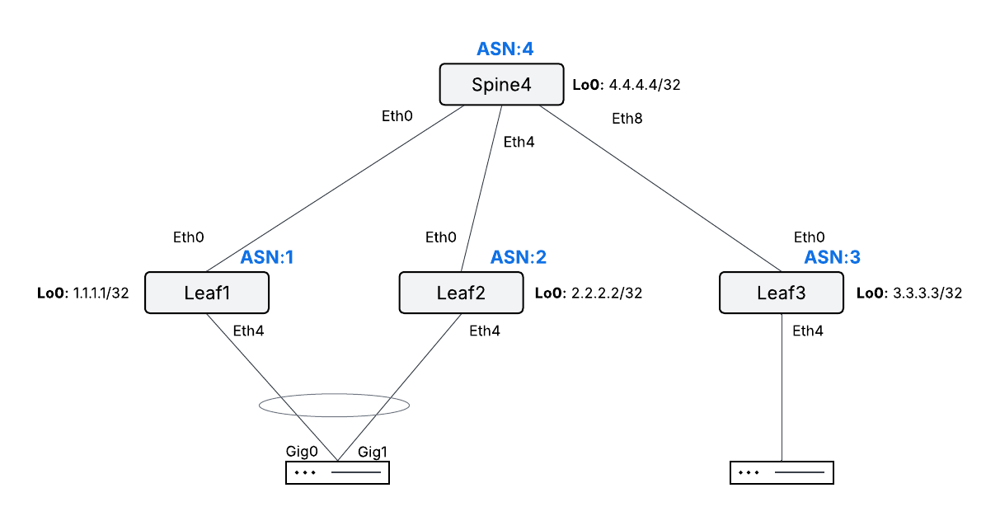
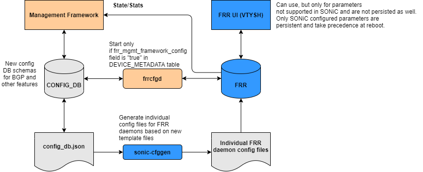

# Lab 2 Guide: SONiC and FRR – Building a BGP Fabric [60 Min]

We use FRR (Free Range Routing) as the routing stack on SONiC to build a fully functional IP BGP fabric. In this lab we will configure eBGP peering across a leaf-spine topology, verify the BGP control plane, and inspect how routing state is reflected in the SONiC Redis database.

## Contents
- [Lab Objectives](#lab-objectives)
- [Topology](#topology)
- [Introduction to SONiC BGP and FRR](#introduction-to-sonic-bgp-and-frr)
  - [What is FRR?](#what-is-frr)
  - [FRR and SONiC Integration — Split-Unified Mode](#frr-and-sonic-integration--split-unified-mode)
  - [The vtysh Shell](#the-vtysh-shell)
  - [Verify FRR Container is Running](#verify-frr-container-is-running)
- [Device Addressing](#device-addressing)
- [Task 1 — Configure Split-Unified Routing Mode](#task-1--configure-split-unified-routing-mode)
- [Task 2 — Interface IPs](#task-2--interface-ips)
- [Task 3 — Underlay BGP Configuration](#task-3--underlay-bgp-configuration)
- [Task 4 — Extensive Verification](#task-4--extensive-verification)
- [Task 5 — Configuration Persistence](#task-5--configuration-persistence)
- [Task 6 — Dynamic Prefix Advertisement](#task-6--dynamic-prefix-advertisement)
- [BGP Logging & Debug](#bgp-logging--debug)

## Lab Objectives

We will have achieved the following objectives upon completion of Lab 2:

* Understand how FRR integrates with SONiC as the BGP routing stack
* Understand the `split` routing configuration mode and its file structure
* Configure and verify SONiC interface IP addressing
* Design and implement a two-tier eBGP leaf-spine fabric
* Configure BGP neighbors, address families, and route-maps using `vtysh`
* Verify BGP session state, learned prefixes, and routing table
* Confirm end-to-end reachability across the fabric
* Inspect BGP routing state in the SONiC Redis database


## Topology





## Introduction to SONiC BGP and FRR

### What is FRR?

FRR (Free Range Routing) is an open-source IP routing protocol suite for Linux. It implements the full range of enterprise routing protocols including BGP, OSPF, IS-IS, PIM, LDP, and more. On SONiC running on Cisco 8000, FRR serves as the routing stack that provides the control plane for all IP routing functions.

FRR consists of a set of daemons, each responsible for a specific protocol:

| Daemon     | Function                                                    |
|------------|-------------------------------------------------------------|
| `zebra`    | Core routing daemon — interfaces with the Linux kernel RIB  |
| `bgpd`     | BGP daemon — manages all BGP sessions and the BGP RIB       |
| `staticd`  | Static route daemon                                         |
| `ospfd`    | OSPF daemon (IPv4)                                          |
| `ospf6d`   | OSPF daemon (IPv6)                                          |
| `isisd`    | IS-IS daemon                                                |

`zebra` acts as the central coordinator. It receives routes from all protocol daemons and programs the best routes into the Linux kernel FIB. SONiC's `fpmsyncd` then reads routes from the kernel and writes them to the Redis APPL_DB, where `orchagent` picks them up and programs the hardware ASIC.



### FRR Routing Config Mode: `split-unified`

In Lab 1 we briefly noted that SONiC uses `split-unified` as its routing configuration mode. Now that we are working directly with BGP, it is worth understanding exactly what this means and why it matters for everything you will do in this lab.

SONiC supports three modes for how FRR daemon configuration is managed inside the `bgp` container:

| Mode | Behaviour |
|---|---|
| `split` | One config file per FRR daemon (`bgpd.conf`, `ospfd.conf`, etc.) — legacy mode |
| `unified` | A single `/etc/frr/frr.conf` for all daemons, managed manually |
| `split-unified` | Single `frr.conf` **but** dynamically synced from `CONFIG_DB` via `bgpcfgd` |

`split-unified` is the recommended and default mode in modern SONiC deployments. It is a hybrid that gives you the best of both worlds.

#### What actually happens under the hood

When `split-unified` is active, a SONiC-specific daemon called **`bgpcfgd`** runs inside the `bgp` container. Its sole job is to watch `CONFIG_DB` for BGP-related changes (neighbors, peer-groups, route-maps, timers, etc.) and translate them into FRR-native configuration, written into `/etc/frr/frr.conf`. The flow looks like this:

```
CONFIG_DB  ──►  bgpcfgd  ──►  /etc/frr/frr.conf  ──►  FRR daemons (bgpd, zebra …)
     ▲                                                         │
     │                    vtysh (direct FRR CLI)  ────────────►│
     │                         │
     └──  config bgp …  ───────┘  (writes back to CONFIG_DB)
```

This has a critical operational implication: **`vtysh` and SONiC `config` commands are both valid entry points**, but they write to different places. Changes made via `vtysh` go directly to FRR and are reflected immediately, but they will be **overwritten by `bgpcfgd`** on the next CONFIG_DB sync unless you also update the database. For persistent, database-driven configuration always prefer the SONiC `config bgp` commands or editing `config_db.json`. Use `vtysh` for live troubleshooting and temporary verification.

#### Why this matters for this BGP lab

Throughout this lab you will use `vtysh` extensively to inspect BGP state, verify neighbor adjacencies, and examine the RIB. You will also use `config` commands to define peers and policy. Understanding that these two interfaces co-exist — and that `bgpcfgd` is the bridge between them — explains several behaviours you will observe:

- Why a BGP neighbor you configure via `config bgp` appears in `vtysh show bgp neighbors` almost immediately
- Why manually editing `/etc/frr/frr.conf` directly is **not recommended** — `bgpcfgd` will overwrite it
- Why `docker exec bgp cat /etc/frr/frr.conf` is a useful diagnostic: it shows the exact FRR config that `bgpcfgd` has generated from the database at that moment

### Task 1 — SONiC mode

These commands are different ways to verify the mode (leaf1, leaf2, leaf3, spine4):  
Please verify the mode on all nodes in the fabric:


```bash
# Query CONFIG_DB directly — the authoritative source
sonic-db-cli CONFIG_DB hget "DEVICE_METADATA|localhost" "docker_routing_config_mode"

# Confirm via the raw config file
cat /etc/sonic/config_db.json | grep docker_routing_config_mode

# Verify the effect: a single frr.conf should exist (not per-daemon files)
docker exec bgp ls /etc/frr/
docker exec bgp cat /etc/frr/frr.conf
```


Expected: `"docker_routing_config_mode": "split-unified"`


If the devices are not running in `split-unified` , please run the following:

```bash
cat > /tmp/routing_mode.json << 'EOF'
{
    "DEVICE_METADATA": {
        "localhost": {
            "docker_routing_config_mode": "split-unified"
        }
    }
}
EOF

sudo config load /tmp/routing_mode.json -y
sudo config save -y
sudo systemctl restart bgp
```


### The `vtysh` Shell

`vtysh` is FRR's unified command shell — a single CLI that multiplexes across all running FRR daemons (`bgpd`, `zebra`, `staticd`, etc.) over Unix sockets. Its syntax is deliberately IOS-like, so if you are coming from Cisco IOS or NX-OS you will feel at home immediately. 

```bash
# From the SONiC host shell (preferred in this lab)
vtysh

# Alternatively, drop into the bgp container first (the linux way :) ) 
docker exec -it bgp vtysh
```

Once inside, the prompt reflects the device hostname:

```
admin@pod9-leaf1:~$ vtysh

Hello, this is FRRouting (version 8.5.4).
Copyright 1996-2005 Kunihiro Ishiguro, et al.

pod9-leaf1#
```

#### `vtysh` and SONiC's `split-unified` Mode — What You Need to Know

As covered in the previous section, `bgpcfgd` owns part of `/etc/frr/frr.conf` and syncs it from `CONFIG_DB`. **But it only manages what the SONiC abstraction layer knows about.** This creates a clean division of responsibility that is important to understand before starting the lab:

| Configuration | Who manages it | How to configure |
|---|---|---|
| Basic BGP neighbors, peer-groups | `bgpcfgd` ← `CONFIG_DB` | `config bgp` SONiC commands |
| Route-maps, prefix-lists | FRR directly | `vtysh` + `write memory` |
| Address-family activation | `bgpcfgd` ← `CONFIG_DB` | `config bgp` SONiC commands |
| Redistribution, timers, advanced BGP | FRR directly | `vtysh` + `write memory` |

In this lab, **all configuration is done via `vtysh`**. This is intentional — route-maps, prefix-lists, and the BGP policy constructs you will build are not abstracted by SONiC's config layer, so `vtysh` is the correct and only interface for them. `write memory` is valid and necessary here.

The one thing to avoid is **mixing both approaches for the same object**. For example, if you create a BGP neighbor via `config bgp neighbor add`, then try to modify that same neighbor in `vtysh`, `bgpcfgd` may overwrite your change on its next sync cycle. Since this lab uses `vtysh` end-to-end, you will not hit this conflict.

> 💡 **Rule of thumb:** if it is in `CONFIG_DB` because you put it there with a `config` command, manage it via `config` commands. If you built it in `vtysh`, manage it in `vtysh`. Don't cross the streams.


#### Key `vtysh` Commands for This Lab

| Command | What It Shows |
|---|---|
| `show running-config` | Full FRR config as seen by all daemons |
| `show bgp summary` | BGP neighbor table — state, prefixes received, uptime |
| `show bgp neighbors` | Detailed per-neighbor info: timers, capabilities, message counters |
| `show bgp neighbors <ip> advertised-routes` | Prefixes this router is advertising to a specific peer |
| `show bgp neighbors <ip> received-routes` | Prefixes received from a specific peer (pre-policy) |
| `show bgp ipv4 unicast` | BGP IPv4 RIB — best-path selection, attributes |
| `show bgp ipv6 unicast` | BGP IPv6 RIB |
| `show ip route` | Full IPv4 FIB as seen by zebra (post-selection) |
| `show ipv6 route` | Full IPv6 FIB |
| `show interface <name>` | Interface state, counters, and IP as seen by FRR |
| `configure terminal` | Enter global config mode (for temporary changes) |
| `write memory` | Flush running config to `frr.conf` (not persistent in split-unified — see above) |


### Verify FRR Container is Running

Before configuring BGP, confirm the FRR BGP container is running on each device:

```
admin@pod9-leaf1:~$ docker ps | grep bgp
```

Expected output:
```
9315128bc995   docker-fpm-frr:latest                "/usr/bin/docker_ini…"   4 days ago   Up 46 minutes             bgp
```

You can also check the FRR daemon status from inside the container:

```
docker exec -it bgp supervisorctl status
```

Expected output:
```
bfdd                             RUNNING   pid 70, uptime 0:47:16
bfdsyncd                         RUNNING   pid 57, uptime 0:47:17
bgpcfgd                          RUNNING   pid 58, uptime 0:47:17
bgpd                             RUNNING   pid 50, uptime 0:47:17
bgpmon                           RUNNING   pid 60, uptime 0:47:17
dependent-startup                EXITED    Apr 24 04:42 AM
fpmsyncd                         RUNNING   pid 61, uptime 0:47:17
ports_frr_notify                 EXITED    Apr 24 04:42 AM
rsyslogd                         RUNNING   pid 30, uptime 0:47:19
staticd                          RUNNING   pid 49, uptime 0:47:17
staticrouteapm                   RUNNING   pid 62, uptime 0:47:17
staticroutebfd                   RUNNING   pid 63, uptime 0:47:17
supervisor-proc-exit-listener    RUNNING   pid 27, uptime 0:47:21
vtysh_b                          EXITED    Apr 24 04:42 AM
zebra                            RUNNING   pid 34, uptime 0:47:19
zsocket                          EXITED    Apr 24 04:42 AM
```


---

## Device Addressing

| Device | AS | Loopback   | Ethernet0    | Spine4-facing IP |
|--------|----|------------|--------------|------------------|
| Spine4 | 4  | 4.4.4.4/32 | —            | —                |
| Leaf1  | 1  | 1.1.1.1/32 | 1.4.1.1/24   | 1.4.1.4/24       |
| Leaf2  | 2  | 2.2.2.2/32 | 2.4.1.2/24   | 2.4.1.4/24       |
| Leaf3  | 3  | 3.3.3.3/32 | 3.4.1.3/24   | 3.4.1.4/24       |

### Spine4 Interface Map

| Interface  | Connects to | IP          |
|------------|-------------|-------------|
| Ethernet0  | Leaf1       | 1.4.1.4/24  |
| Ethernet4  | Leaf2       | 2.4.1.4/24  |
| Ethernet8  | Leaf3       | 3.4.1.4/24  |
| Loopback0  | —           | 4.4.4.4/32  |

---

## Task 2 — Interface IPs

**Leaf1:**

```bash
sudo config interface ip add Ethernet0 1.4.1.1/24
sudo config interface ip add Loopback0 1.1.1.1/32
sudo config save -y
```

**Leaf2:**

```bash
sudo config interface ip add Ethernet0 2.4.1.2/24
sudo config interface ip add Loopback0 2.2.2.2/32
sudo config save -y
```

**Leaf3:**

```bash
sudo config interface ip add Ethernet0 3.4.1.3/24
sudo config interface ip add Loopback0 3.3.3.3/32
sudo config save -y
```

**Spine4:**

```bash
sudo config interface ip add Ethernet0 1.4.1.4/24
sudo config interface ip add Ethernet4 2.4.1.4/24
sudo config interface ip add Ethernet8 3.4.1.4/24
sudo config interface ip add Loopback0 4.4.4.4/32
sudo config save -y
```

### Verification — show ip interfaces

```bash
show ip interfaces
```

**Leaf1** output:
```
Interface    Master    IPv4 address/mask    Admin/Oper    BGP Neighbor    Neighbor IP
-----------  --------  -------------------  ------------  --------------  -------------
Ethernet0              1.4.1.1/24           up/up         N/A             N/A
Loopback0              1.1.1.1/32           up/up         N/A             N/A
docker0                240.127.1.1/24       up/down       N/A             N/A
eth0                   192.168.122.66/24    up/up         N/A             N/A
lo                     127.0.0.1/16         up/up         N/A             N/A
```

All lab interfaces must show `up/up` before proceeding.


## Task 2 — Verification

Before moving to BGP configuration, verify all three underlay links are operational from **Spine4**:

```bash
# Confirm interfaces and IPs are correctly assigned
show ip interfaces
```

```bash
# Ping each directly connected neighbor — not the loopbacks (unreachable until BGP is up)
ping 1.4.1.1 -c 3   # Leaf1 via Ethernet0
ping 2.4.1.2 -c 3   # Leaf2 via Ethernet4
ping 3.4.1.3 -c 3   # Leaf3 via Ethernet8

```

> ⚠️ **Do not proceed to Task 3 until all three pings succeed.** A BGP session will never establish over a broken underlay. If a ping fails, check `show interfaces status` on both ends and verify the IP assignment with `show ip interfaces`.

> 💡 **Why neighbor IPs and not loopbacks?** At this stage only the directly connected `/24` subnets exist in the routing table. Loopback addresses (`1.1.1.1/32`, `2.2.2.2/32`, `3.3.3.3/32`) are not reachable until BGP is up and advertising them. A successful ping to each neighbor IP is sufficient to confirm the link is up, the IP is correctly assigned on both ends, and the ASIC is forwarding.

---

## Task 3 — Underlay BGP Configuration

> **FRR defaults to be aware of:**
> - **`bgp ebgp-requires-policy`** is enabled by default in FRR. Every eBGP neighbor must have an explicit inbound and outbound route-map applied, or no routes will be exchanged. This is why `route-map PASS` is applied to all neighbors.
> - **`no bgp default ipv4-unicast`** is set explicitly here. By default in FRR, all neighbors are automatically activated in the IPv4 unicast address-family. Disabling this ensures neighbors are only activated where explicitly configured.

> [!NOTE]
> Enter `vtysh` and `config terminal` on each device before pasting.

**Leaf1:**

```
conf t
ip prefix-list LOOPBACKS seq 5 permit 1.1.1.1/32

route-map PASS permit 10
exit

route-map ADVERTISE permit 10
 match ip address prefix-list LOOPBACKS
exit

router bgp 1
 bgp router-id 1.1.1.1
 no bgp default ipv4-unicast
 neighbor SPINE peer-group
 neighbor SPINE remote-as 4
 neighbor 1.4.1.4 peer-group SPINE
 !
 address-family ipv4 unicast
  redistribute connected
  neighbor SPINE activate
  neighbor SPINE route-map PASS in
  neighbor SPINE route-map ADVERTISE out
 exit-address-family
exit
```

**Leaf2:**

```
conf t
ip prefix-list LOOPBACKS seq 5 permit 2.2.2.2/32

route-map PASS permit 10
exit

route-map ADVERTISE permit 10
 match ip address prefix-list LOOPBACKS
exit

router bgp 2
 bgp router-id 2.2.2.2
 no bgp default ipv4-unicast
 neighbor SPINE peer-group
 neighbor SPINE remote-as 4
 neighbor 2.4.1.4 peer-group SPINE
 !
 address-family ipv4 unicast
  redistribute connected
  neighbor SPINE activate
  neighbor SPINE route-map PASS in
  neighbor SPINE route-map ADVERTISE out
 exit-address-family
exit
```

**Leaf3:**

```
conf t
ip prefix-list LOOPBACKS seq 5 permit 3.3.3.3/32

route-map PASS permit 10
exit

route-map ADVERTISE permit 10
 match ip address prefix-list LOOPBACKS
exit

router bgp 3
 bgp router-id 3.3.3.3
 no bgp default ipv4-unicast
 neighbor SPINE peer-group
 neighbor SPINE remote-as 4
 neighbor 3.4.1.4 peer-group SPINE
 !
 address-family ipv4 unicast
  redistribute connected
  neighbor SPINE activate
  neighbor SPINE route-map PASS in
  neighbor SPINE route-map ADVERTISE out
 exit-address-family
exit
```

**Spine4:**

```
conf t
route-map PASS permit 10
exit

router bgp 4
 bgp router-id 4.4.4.4
 no bgp default ipv4-unicast
 neighbor LEAF peer-group
 neighbor 1.4.1.1 remote-as 1
 neighbor 1.4.1.1 peer-group LEAF
 neighbor 2.4.1.2 remote-as 2
 neighbor 2.4.1.2 peer-group LEAF
 neighbor 3.4.1.3 remote-as 3
 neighbor 3.4.1.3 peer-group LEAF
 !
 address-family ipv4 unicast
  redistribute connected
  neighbor LEAF activate
  neighbor LEAF route-map PASS in
  neighbor LEAF route-map PASS out
 exit-address-family
exit
```

---

## Task 4 — Extensive Verification

### 4.1 FRR Running Configuration

Confirms the full FRR config is applied as expected. Check router-id, AS number, peer-group membership, route-maps, and prefix-lists.

From the SONiC CLI :
```bash
vtysh -c 'show running-config'
```

or simply within the vtysh cli

```bash
show run
```

**Spine4** output:
```
admin@pod9-spine4:~$ vtysh

Hello, this is FRRouting (version 8.5.4).
Copyright 1996-2005 Kunihiro Ishiguro, et al.

pod9-spine4# show running-config
Building configuration...

Current configuration:
!
frr version 8.5.4
frr defaults traditional
hostname pod9-spine4
no zebra nexthop kernel enable
fpm address 127.0.0.1
no fpm use-next-hop-groups
service integrated-vtysh-config
!
router bgp 4
 bgp router-id 4.4.4.4
 no bgp default ipv4-unicast
 neighbor LEAF peer-group
 neighbor 1.4.1.1 remote-as 1
 neighbor 1.4.1.1 peer-group LEAF
 neighbor 2.4.1.2 remote-as 2
 neighbor 2.4.1.2 peer-group LEAF
 neighbor 3.4.1.3 remote-as 3
 neighbor 3.4.1.3 peer-group LEAF
 !
 address-family ipv4 unicast
  redistribute connected
  neighbor LEAF activate
  neighbor LEAF route-map PASS in
  neighbor LEAF route-map PASS out
 exit-address-family
exit
!
route-map RM_SET_SRC permit 10
 set src 4.4.4.4
exit
!
route-map PASS permit 10
exit
!
ip protocol bgp route-map RM_SET_SRC
!
end
```

---

### 4.2 BGP Neighbor Summary

All neighbors must show a numeric `PfxRcd` value (not `Active`, `Idle`, or `Connect`).

Run the following on **both Leaf1 and Spine4**:

```bash
vtysh -c 'show bgp ipv4 unicast summary'
```

or from the vtysh cli

```bash
show bgp ipv4 unicast summary
```


**Leaf1** output:
```
pod9-leaf1# show bgp ipv4 unicast summary
BGP router identifier 1.1.1.1, local AS number 1 vrf-id 0
BGP table version 10
RIB entries 19, using 4256 bytes of memory
Peers 1, using 22 KiB of memory
Peer groups 1, using 64 bytes of memory

Neighbor        V         AS   MsgRcvd   MsgSent   TblVer  InQ OutQ  Up/Down State/PfxRcd   PfxSnt Desc
1.4.1.4         4          4        65        43        0    0    0 00:34:57            8        1 N/A

Total number of neighbors 1
```

- `PfxRcd 8` — 8 prefixes received from Spine4 (loopbacks + connected subnets from all devices).
- `PfxSnt 1` — only the local loopback (`1.1.1.1/32`), filtered by the `ADVERTISE` route-map.

**Spine4** output:
```
pod9-spine4# show ip bgp summary

IPv4 Unicast Summary (VRF default):
BGP router identifier 4.4.4.4, local AS number 4 vrf-id 0
BGP table version 9
RIB entries 17, using 3808 bytes of memory
Peers 3, using 66 KiB of memory
Peer groups 1, using 64 bytes of memory

Neighbor        V         AS   MsgRcvd   MsgSent   TblVer  InQ OutQ  Up/Down State/PfxRcd   PfxSnt Desc
1.4.1.1         4          1        43        67        0    0    0 00:36:51            1        9 N/A
2.4.1.2         4          2        43        67        0    0    0 00:36:51            1        9 N/A
3.4.1.3         4          3        43        67        0    0    0 00:36:51            1        9 N/A

Total number of neighbors 3
```

- All three leaf sessions are `Established` with `PfxRcd 1` — each leaf advertises only its loopback.
- `PfxSnt 9` — Spine4 sends all connected subnets plus every loopback it has learned from the other leaves.

---

### 4.3 BGP Route Table

`*>` marks the best path. Remote loopbacks should show AS paths through the spine.

```bash
vtysh -c 'show bgp ipv4 unicast'
```

or from the vtysh cli

```bash
show bgp ipv4 unicast 
```


**Leaf1** output:
```
BGP table version is 21, local router ID is 1.1.1.1, vrf id 0
Default local pref 100, local AS 1
Status codes:  s suppressed, d damped, h history, * valid, > best, = multipath,
               i internal, r RIB-failure, S Stale, R Removed
Nexthop codes: @NNN nexthop's vrf id, < announce-nh-self
Origin codes:  i - IGP, e - EGP, ? - incomplete
RPKI validation codes: V valid, I invalid, N Not found

    Network          Next Hop            Metric LocPrf Weight Path
 *> 1.1.1.1/32       0.0.0.0                  0         32768 ?
 *  1.4.1.0/24       1.4.1.4                  0             0 4 ?
 *>                  0.0.0.0                  0         32768 ?
 *> 2.2.2.2/32       1.4.1.4                                0 4 2 ?
 *> 2.4.1.0/24       1.4.1.4                  0             0 4 ?
 *> 3.3.3.3/32       1.4.1.4                                0 4 3 ?
 *> 3.4.1.0/24       1.4.1.4                  0             0 4 ?
 *> 4.4.4.4/32       1.4.1.4                  0             0 4 ?
 *  192.168.122.0/24 1.4.1.4                  0             0 4 ?
 *>                  0.0.0.0                  0         32768 ?
 *  192.168.123.0/24 1.4.1.4                  0             0 4 ?
 *>                  0.0.0.0                  0         32768 ?

Displayed  9 routes and 12 total paths
```

- Remote loopbacks (`2.2.2.2/32`, `3.3.3.3/32`, `4.4.4.4/32`) show AS paths through Spine4 (AS 4).
- Locally originated routes have next-hop `0.0.0.0` and weight `32768`.
- For shared subnets (`1.4.1.0/24`), both a local and remote path exist — the local path (`*>`) wins.

---

### 4.4 Detailed BGP Neighbor Information

Full session details: capabilities, timers, message counters, graceful restart state.

```bash
vtysh -c 'show bgp neighbors 1.4.1.4'
```

or from vtysh cli


```bash
show bgp neighbors 1.4.1.4
```


**Leaf1** output:
```
BGP neighbor is 1.4.1.4, remote AS 4, local AS 1, external link
  Local Role: undefined
  Remote Role: undefined
Hostname: pod12-spine4
 Member of peer-group SPINE for session parameters
  BGP version 4, remote router ID 4.4.4.4, local router ID 1.1.1.1
  BGP state = Established, up for 00:00:32
  Last read 00:00:30, Last write 00:00:31
  Hold time is 180 seconds, keepalive interval is 60 seconds
  Neighbor capabilities:
    4 Byte AS: advertised and received
    Extended Message: advertised and received
    AddPath:
      IPv4 Unicast: RX advertised and received
    Long-lived Graceful Restart: advertised and received
    Route refresh: advertised and received(old & new)
    Enhanced Route Refresh: advertised and received
    Address Family IPv4 Unicast: advertised and received
    Hostname Capability: advertised (name: pod12-leaf1,domain name: n/a) received (name: pod12-spine4,domain name: n/a)
    Graceful Restart Capability: advertised and received
      Remote Restart timer is 120 seconds
  Graceful restart information:
    End-of-RIB send: IPv4 Unicast
    End-of-RIB received: IPv4 Unicast
    Local GR Mode: Helper*
    Remote GR Mode: Helper
  Message statistics:
                         Sent       Rcvd
    Opens:                  3          3
    Notifications:          2          0
    Updates:                4         20
    Keepalives:             3          2
    Route Refresh:          0          0
    Total:                 12         25

 For address family: IPv4 Unicast
  SPINE peer-group member
  Route map for incoming advertisements is *PASS
  Route map for outgoing advertisements is *ADVERTISE
  8 accepted prefixes

  Connections established 2; dropped 1
Local host: 1.4.1.1, Local port: 179
Foreign host: 1.4.1.4, Foreign port: 43234
```

Key fields to verify:
- **BGP state = Established** — session is up and exchanging routes.
- **Hold time / keepalive** — default 180s/60s. If the hold timer expires, the session drops.
- **Route map for incoming / outgoing** — confirms `PASS` inbound and `ADVERTISE` outbound.
- **8 accepted prefixes** — matches what `show bgp summary` reports.
- **Connections established / dropped** — high drop counts indicate instability.
- **End-of-RIB send: IPv4 Unicast / End-of-RIB received: IPv4 Unicast** — both ends have signalled
  End-of-RIB, meaning initial BGP table convergence is complete on this session. This is the marker FRR
  uses to exit the BGP initial convergence window.
---

### 4.5 Route-Map Verification

Shows invocation counts — how many times each route-map was evaluated and how many routes matched.

```bash
vtysh -c 'show route-map'
```

or from vtysh

```bash
show route-map
```


**Leaf1** output:
```
ZEBRA:
route-map: RM_SET_SRC Invoked: 10
 permit, sequence 10 Invoked 10
  Set clauses:
    src 1.1.1.1

BGP:
route-map: ADVERTISE Invoked: 18
 permit, sequence 10 Invoked 2
  Match clauses:
    ip address prefix-list LOOPBACKS

route-map: PASS Invoked: 16
 permit, sequence 10 Invoked 16
  Match clauses:
```

- `ADVERTISE Invoked 2` out of 18 evaluations — only the loopback matched. The rest were implicitly denied (connected subnets filtered out).
- `PASS Invoked 16` — all inbound prefixes passed through.
- `RM_SET_SRC Invoked 10` — applied to BGP routes installed into the kernel, setting the loopback as source.

`RM_SET_SRC` is a Zebra route-map that instructs FRR to set a **preferred source address** on
BGP routes when installing them into the Linux kernel FIB. It is configured once, globally,
and applies to all BGP-learned routes:

```
ip protocol bgp route-map RM_SET_SRC

route-map RM_SET_SRC permit 10
 set src 1.1.1.1
```

Without it, the Linux kernel defaults to using the **egress interface IP** (`1.4.1.1`) as the
source address for any traffic this device originates toward a BGP-learned destination. This
works under normal conditions but is fragile — if `Ethernet0` goes down, that source address
disappears with it.

By setting `src 1.1.1.1` (the loopback), all locally-originated traffic uses a
**stable, interface-independent address** that remains reachable as long as any path to it
exists in the fabric. This is standard practice in any BGP-routed data-center fabric and a
prerequisite for correct behaviour when BGP sessions are later moved to loopback peering.

> 💡 You will see the effect of this route-map in two places as you work through this lab:
> in `vtysh` as `rmapsrc 1.1.1.1` on each BGP route, and in the Linux kernel as `src 1.1.1.1`
> in the output of `ip route show proto bgp`.

---

### 4.6 FRR IP Route Table

`B>*` = best BGP route installed in FIB. `C>*` = directly connected. `rmapsrc` confirms the source-address route-map is working.

```bash
vtysh -c 'show ip route'
```

or 

```bash
show ip route
```

**Leaf1** output:
```
Codes: K - kernel route, C - connected, S - static, R - RIP,
       O - OSPF, I - IS-IS, B - BGP, E - EIGRP, N - NHRP,
       T - Table, v - VNC, V - VNC-Direct, A - Babel, F - PBR,
       f - OpenFabric, J - Adjacency,
       > - selected route, * - FIB route, q - queued, r - rejected, b - backup
       t - trapped, o - offload failure

K * 0.0.0.0/0 [0/202] via 192.168.122.1, eth0, 00:06:40
K>* 0.0.0.0/0 [0/0] via 192.168.123.1, eth4, 00:06:40
C>* 1.1.1.1/32 is directly connected, Loopback0, 00:05:28
C>* 1.4.1.0/24 is directly connected, Ethernet0, 00:02:19
B>* 2.2.2.2/32 [20/0] via 1.4.1.4, Ethernet0, rmapsrc 1.1.1.1, weight 1, 00:00:30
B>* 2.4.1.0/24 [20/0] via 1.4.1.4, Ethernet0, rmapsrc 1.1.1.1, weight 1, 00:00:30
B>* 3.3.3.3/32 [20/0] via 1.4.1.4, Ethernet0, rmapsrc 1.1.1.1, weight 1, 00:00:30
B>* 3.4.1.0/24 [20/0] via 1.4.1.4, Ethernet0, rmapsrc 1.1.1.1, weight 1, 00:00:30
B>* 4.4.4.4/32 [20/0] via 1.4.1.4, Ethernet0, rmapsrc 1.1.1.1, weight 1, 00:00:30
C>* 192.168.122.0/24 is directly connected, eth0, 00:06:40
C>* 192.168.123.0/24 is directly connected, eth4, 00:06:40
K>* 240.127.1.0/24 [0/0] is directly connected, docker0, 00:06:40
```

- `rmapsrc 1.1.1.1` — `RM_SET_SRC` is working, forcing the loopback as the source for BGP-learned routes.
- `[20/0]` — administrative distance 20 (eBGP), metric 0.
- Two default routes (`0.0.0.0/0`)** — one via `eth0` (192.168.122.1) and one via `eth4`
  (192.168.123.1). These are management-plane routes, not data-plane. Notice they use `eth0`/`eth4`
  (OOB interfaces), not `Ethernet0`. They will never be used for BGP forwarding but confirm the
  management network is reachable. The `K>*` wins over `K *` due to lower administrative distance.
---

### 4.7 Route Programming & Nexthop Resolution — Kernel, APP_DB, and ASIC

A route in the BGP RIB is useless unless it is programmed all the way down to the hardware ASIC and the next-hop can be resolved to a directly connected neighbor. This section traces the full route-programming chain from the Linux kernel through SONiC's APP_DB down to the hardware ASIC, and shows how the nexthop is resolved at each layer.

#### Linux Kernel Route Table

The kernel is what actually forwards packets. `proto bgp`  confirms FRR (Zebra) programmed the route. The `src` field shows the source address set by `RM_SET_SRC`.


This is a fundamentally different view from `show ip route` in `vtysh`. Understanding the distinction is important:

|                        | `vtysh` — `show ip route`  | Linux — `ip route show`             |
|------------------------|----------------------------|-------------------------------------|
| **Owner**              | FRR / Zebra RIB            | Linux kernel FIB                    |
| **What it shows**      | All routes FRR knows about | Routes actually used for forwarding |
| **`proto bgp`** filter | N/A                        | Filters to routes installed by FRR  |


Type this command on leaf1 (not on vtysh):

```bash
ip route show proto bgp
```

**Leaf1** output:
```
2.2.2.2 via 1.4.1.4 dev Ethernet0 src 1.1.1.1 metric 20
2.4.1.0/24 via 1.4.1.4 dev Ethernet0 src 1.1.1.1 metric 20
3.3.3.3 via 1.4.1.4 dev Ethernet0 src 1.1.1.1 metric 20
3.4.1.0/24 via 1.4.1.4 dev Ethernet0 src 1.1.1.1 metric 20
4.4.4.4 via 1.4.1.4 dev Ethernet0 src 1.1.1.1 metric 20
```

Each field tells a precise story:

| Field          | Value             | Meaning                                                                  |
|----------------|-------------------|--------------------------------------------------------------------------|
| `proto bgp`    | (filter used)     | Route was installed by FRR Zebra via Netlink — not static, not connected |
| `via 1.4.1.4`  | Spine4's IP       | Next-hop — all BGP routes on Leaf1 transit Spine4 at this stage          |
| `dev Ethernet0`| Front-panel port  | Egress interface — confirms the data-plane port, not `eth0`              |
| `src 1.1.1.1`  | Loopback0 address | Preferred source address set by `RM_SET_SRC`                             |
| `metric 20`    | eBGP AD           | Administrative distance 20 translated into a kernel metric               |


If `src` showed `1.4.1.1` (the Ethernet0 address) instead of `1.1.1.1` (the loopback), the `RM_SET_SRC` route-map is missing or not applied.

#### Linux ARP / Neighbor Table

For the kernel to forward to `1.4.1.4`, it needs the MAC address of that next-hop. The ARP table shows the L2 resolution.

```bash
ip neigh show dev Ethernet0
```

**Leaf1** output:
```
1.4.1.4 lladdr 78:61:32:bf:bc:00 REACHABLE
```

The next-hop is `REACHABLE`. If it shows `FAILED` or `INCOMPLETE`, L2 adjacency is broken (check interface state, cabling, or IP mismatch).

#### SONiC APP_DB (ROUTE_TABLE and NEIGH_TABLE)

FRR pushes routes to the SONiC `fpmsyncd` daemon via the FPM (Forwarding Plane Manager) socket. `fpmsyncd` writes them into APP_DB's `ROUTE_TABLE`, which `orchagent` then programs into the ASIC.

List all routes in APP_DB:

```bash
sonic-db-cli APPL_DB keys 'ROUTE_TABLE:*'
```

**Leaf1** output:
```
ROUTE_TABLE:0.0.0.0/0
ROUTE_TABLE:1.1.1.1
ROUTE_TABLE:1.4.1.0/24
ROUTE_TABLE:2.2.2.2
ROUTE_TABLE:2.4.1.0/24
ROUTE_TABLE:3.3.3.3
ROUTE_TABLE:3.4.1.0/24
ROUTE_TABLE:4.4.4.4
```

Inspect a specific route to see the nexthop and egress interface:

```bash
sonic-db-cli APPL_DB hgetall 'ROUTE_TABLE:2.2.2.2'
```

```
{'protocol': 'bgp', 'nexthop': '1.4.1.4', 'ifname': 'Ethernet0'}
```

```bash
sonic-db-cli APPL_DB hgetall 'ROUTE_TABLE:4.4.4.4'
```

```
{'protocol': 'bgp', 'nexthop': '1.4.1.4', 'ifname': 'Ethernet0'}
```

All remote loopbacks point to nexthop `1.4.1.4` via `Ethernet0`.

The neighbor's MAC is stored in NEIGH_TABLE — this is what `orchagent` uses to program the ASIC's L2 rewrite entry:

```bash
sonic-db-cli APPL_DB hgetall 'NEIGH_TABLE:Ethernet0:1.4.1.4'
```

```
{'neigh': '78:61:32:bf:bc:00', 'family': 'IPv4'}
```

This matches the ARP entry from `ip neigh show`.

#### SONiC ASIC_DB (SAI Object Store)

> **Where does ASIC_DB fit?**
> Think of it as a paper trail. `orchagent` takes routes from APP_DB, converts them into
> hardware instructions, writes them to ASIC_DB, and the SAI SDK programs the ASIC.
>
> - **APP_DB** → what FRR wants the hardware to do
> - **ASIC_DB** → what `orchagent` asked the ASIC to do
> - **`show platform npu`** → what the ASIC actually did
>
> A route in APP_DB but missing from ASIC_DB means `orchagent` failed. A route in ASIC_DB
> but not forwarding means the SAI/hardware layer failed. That distinction tells you exactly
> where to look when things break.


ASIC_DB keys are SAI object types with JSON-encoded key fields. The main ones for route verification are:

| SAI Object Type                    | What it stores                        |
|------------------------------------|---------------------------------------|
| `SAI_OBJECT_TYPE_ROUTE_ENTRY`      | Prefix → nexthop OID mapping          |
| `SAI_OBJECT_TYPE_NEXT_HOP`         | Nexthop IP + router interface OID     |
| `SAI_OBJECT_TYPE_NEIGHBOR_ENTRY`   | Neighbor IP → destination MAC         |
| `SAI_OBJECT_TYPE_ROUTER_INTERFACE` | Interface → port OID, source MAC, MTU |

##### List all route entries

```bash
sonic-db-cli ASIC_DB keys 'ASIC_STATE:SAI_OBJECT_TYPE_ROUTE_ENTRY:*'
```
> [!NOTE]
> Each SONiC device will have it's own unique OID for the pod so you will need to substitute your routers OID output to the below commands.
>

**Leaf1** output (IPv4 entries only):
```
ASIC_STATE:SAI_OBJECT_TYPE_ROUTE_ENTRY:{"dest":"2.2.2.2/32","switch_id":"oid:0x21000000000000","vr":"oid:0x3000000000042"}
ASIC_STATE:SAI_OBJECT_TYPE_ROUTE_ENTRY:{"dest":"3.3.3.3/32","switch_id":"oid:0x21000000000000","vr":"oid:0x3000000000042"}
ASIC_STATE:SAI_OBJECT_TYPE_ROUTE_ENTRY:{"dest":"4.4.4.4/32","switch_id":"oid:0x21000000000000","vr":"oid:0x3000000000042"}
ASIC_STATE:SAI_OBJECT_TYPE_ROUTE_ENTRY:{"dest":"1.1.1.1/32","switch_id":"oid:0x21000000000000","vr":"oid:0x3000000000042"}
ASIC_STATE:SAI_OBJECT_TYPE_ROUTE_ENTRY:{"dest":"1.4.1.0/24","switch_id":"oid:0x21000000000000","vr":"oid:0x3000000000042"}
ASIC_STATE:SAI_OBJECT_TYPE_ROUTE_ENTRY:{"dest":"2.4.1.0/24","switch_id":"oid:0x21000000000000","vr":"oid:0x3000000000042"}
ASIC_STATE:SAI_OBJECT_TYPE_ROUTE_ENTRY:{"dest":"3.4.1.0/24","switch_id":"oid:0x21000000000000","vr":"oid:0x3000000000042"}
ASIC_STATE:SAI_OBJECT_TYPE_ROUTE_ENTRY:{"dest":"0.0.0.0/0","switch_id":"oid:0x21000000000000","vr":"oid:0x3000000000042"}
```

##### Trace a single route through ASIC_DB

Look up the route entry for `2.2.2.2/32` to find the nexthop OID it points to:

```bash
sonic-db-cli ASIC_DB hgetall 'ASIC_STATE:SAI_OBJECT_TYPE_ROUTE_ENTRY:{"dest":"2.2.2.2/32","switch_id":"oid:0x21000000000000","vr":"oid:0x3000000000042"}'
```

```
{'SAI_ROUTE_ENTRY_ATTR_NEXT_HOP_ID': 'oid:0x400000000097e'}
```

Follow the nexthop OID to find the IP and router interface:

```bash
sonic-db-cli ASIC_DB hgetall 'ASIC_STATE:SAI_OBJECT_TYPE_NEXT_HOP:oid:0x400000000097e'
```

```
{'SAI_NEXT_HOP_ATTR_TYPE': 'SAI_NEXT_HOP_TYPE_IP', 'SAI_NEXT_HOP_ATTR_IP': '1.4.1.4', 'SAI_NEXT_HOP_ATTR_ROUTER_INTERFACE_ID': 'oid:0x600000000096b'}
```

Look up the neighbor entry for `1.4.1.4` to find the destination MAC:

```bash
sonic-db-cli ASIC_DB hgetall 'ASIC_STATE:SAI_OBJECT_TYPE_NEIGHBOR_ENTRY:{"ip":"1.4.1.4","rif":"oid:0x600000000096b","switch_id":"oid:0x21000000000000"}'
```

```
{'SAI_NEIGHBOR_ENTRY_ATTR_DST_MAC_ADDRESS': '78:61:32:BF:BC:00'}
```

Optionally, check the router interface to confirm the egress port and source MAC:

```bash
sonic-db-cli ASIC_DB hgetall 'ASIC_STATE:SAI_OBJECT_TYPE_ROUTER_INTERFACE:oid:0x600000000096b'
```

```
{'SAI_ROUTER_INTERFACE_ATTR_VIRTUAL_ROUTER_ID': 'oid:0x3000000000042', 'SAI_ROUTER_INTERFACE_ATTR_SRC_MAC_ADDRESS': '78:EC:2B:CF:A8:00', 'SAI_ROUTER_INTERFACE_ATTR_TYPE': 'SAI_ROUTER_INTERFACE_TYPE_PORT', 'SAI_ROUTER_INTERFACE_ATTR_PORT_ID': 'oid:0x1000000000002', 'SAI_ROUTER_INTERFACE_ATTR_MTU': '9100'}
```

The full ASIC_DB chain for `2.2.2.2/32`: (Route → Next-Hop OID → Router Interface OID → Port OID → Physical Interface)


```
Route  →  nexthop OID 0x400000000097e
           →  IP 1.4.1.4, router-interface OID 0x600000000096b
                →  dst-MAC 78:61:32:BF:BC:00 (neighbor entry)
                →  src-MAC 78:EC:2B:CF:A8:00, port OID 0x1000000000002, MTU 9100 (router interface)
```

> **Note:** All BGP-learned routes (`2.2.2.2/32`, `3.3.3.3/32`, `4.4.4.4/32`, etc.) point to the same nexthop OID `0x400000000097e` because they all resolve via the single nexthop `1.4.1.4` on Ethernet0.

🔥 **Bonus:** To find the name of the outgoing interface, here is a little python script. Ethernet0 (not eth0 :)) is the outgoing interface.

```bash
sonic-db-cli COUNTERS_DB hgetall COUNTERS_PORT_NAME_MAP | python3 -c "
import sys, ast
d = ast.literal_eval(sys.stdin.read())
print({v: k for k, v in d.items()}.get('oid:0x1000000000002', 'not found'))
"


Ethernet0
```

The next NPU verification gives a much simpler way to trace the next hop and the outgoing interface.

#### ASIC / NPU Verification (show platform npu)

These commands query the hardware ASIC directly. If a route is in APP_DB but not in the NPU route table, `orchagent` failed to program it.

##### NPU Route Table

Shows every prefix programmed into the ASIC. `dest-type` tells you what happens to matching packets:
- `next-hop` — forwarded via a resolved nexthop (normal routing)
- `for-us` — destined to the switch itself (local IPs)
- `host` — connected subnet (glean/ARP resolution)

```bash
sudo show platform npu router route-table
```

**Leaf1** output:
```
+-----------+----------------+-----------+---------------------------------+-------+--------+
| router-id | ip-prefix      | dest-type | dest-info                       | drop  | ip-ver |
+-----------+----------------+-----------+---------------------------------+-------+--------+
| 0x0       | 1.1.1.1/32     | for-us    | N/A                             | False | 4      |
| 0x0       | 1.4.1.1/32     | for-us    | N/A                             | False | 4      |
| 0x0       | 1.4.1.0/24     | host      | N/A                             | False | 4      |
| 0x0       | 2.2.2.2/32     | next-hop  | ['normal', '78:61:32:bf:bc:00'] | False | 4      |
| 0x0       | 2.4.1.0/24     | next-hop  | ['normal', '78:61:32:bf:bc:00'] | False | 4      |
| 0x0       | 3.3.3.3/32     | next-hop  | ['normal', '78:61:32:bf:bc:00'] | False | 4      |
| 0x0       | 3.4.1.0/24     | next-hop  | ['normal', '78:61:32:bf:bc:00'] | False | 4      |
| 0x0       | 4.4.4.4/32     | next-hop  | ['normal', '78:61:32:bf:bc:00'] | False | 4      |
| 0x0       | 0.0.0.0/0      | next-hop  | drop                            | True  | 4      |
+-----------+----------------+-----------+---------------------------------+-------+--------+
```

- All BGP-learned prefixes (`2.2.2.2/32`, `3.3.3.3/32`, `4.4.4.4/32`) are `next-hop` type with MAC `78:61:32:bf:bc:00` (Spine4's Ethernet0 MAC).
- Local IPs (`1.1.1.1/32`, `1.4.1.1/32`) are `for-us` — packets to these addresses are punted to the CPU.
- The connected subnet (`1.4.1.0/24`) is `host` type — triggers ARP resolution for unknown destinations in that range.
- Default route (`0.0.0.0/0`) shows `drop: True` — unmatched traffic is dropped in hardware.

##### NPU Prefix-to-Nexthop Mapping

Drills into a single prefix and shows the full ASIC forwarding chain: VRF → prefix → nexthop OID → destination MAC → egress L3 port → physical interface.

```bash
sudo show platform npu router prefix -ip 2.2.2.2/32
```

**Leaf1** output:
```
+-------------+------------+---------+------------------+-----------------+
|   vrf oid   |   Prefix   | Is Host | Destination Type | Destination OID |
+-------------+------------+---------+------------------+-----------------+
| la_vrf(265) | 2.2.2.2/32 |  False  |     NEXT_HOP     |      10489      |
+-------------+------------+---------+------------------+-----------------+

+-------+-------------------+--------------+-----------------------+-----------+
|  oid  |    Nexthop MAC    | Nexthop Type | router port(type/oid) |   IfName  |
+-------+-------------------+--------------+-----------------------+-----------+
| 10489 | 78:61:32:bf:bc:00 |  NORMAL(0)   |   la_l3_ac_port/618   | Ethernet0 |
+-------+-------------------+--------------+-----------------------+-----------+
```

The prefix `2.2.2.2/32` is in VRF `la_vrf(265)`, points to nexthop OID `10489`, which rewrites the dst-MAC to `78:61:32:bf:bc:00` and egresses via `Ethernet0`.

##### NPU Next-Hop Table

Shows all nexthop entries programmed in the ASIC, their MAC addresses, and reference counts.

```bash
sudo show platform npu next-hop entries
```

**Leaf1** output:
```
+-------+-------------+-------------------+-----------+---------------+
| index | next-hop-id | mac-addr          | ref-count | next-hop-type |
+-------+-------------+-------------------+-----------+---------------+
| 0     | 0xfff       | None              | 0         | DROP          |
| 1     | 0x0         | None              | 3         | DROP          |
| 2     | 0x1         | 78:61:32:bf:bc:00 | 6         | NORMAL        |
+-------+-------------+-------------------+-----------+---------------+
```

- Leaf1 has a single `NORMAL` nexthop (Spine4's MAC) with `ref-count 6` — six prefixes reference this nexthop (the five BGP routes + one connected subnet via the spine).
- Two `DROP` entries are system defaults.

#### Resolution Chain Summary

A packet to `2.2.2.2` on Leaf1 is forwarded as follows:

```
BGP RIB           →  2.2.2.2/32 via 1.4.1.4 (AS path: 4 2)
FRR RIB           →  B>* 2.2.2.2/32 via 1.4.1.4, Ethernet0, rmapsrc 1.1.1.1
Linux kernel      →  2.2.2.2 via 1.4.1.4 dev Ethernet0 proto bgp src 1.1.1.1
ARP table         →  1.4.1.4 → MAC 78:61:32:bf:bc:00
APP_DB ROUTE      →  nexthop 1.4.1.4, ifname Ethernet0
APP_DB NEIGH      →  78:61:32:bf:bc:00
ASIC_DB ROUTE     →  nexthop OID 0x400000000097e
ASIC_DB NEXT_HOP  →  IP 1.4.1.4, rif OID 0x600000000096b
ASIC_DB NEIGHBOR  →  dst-MAC 78:61:32:BF:BC:00
NPU route-table   →  2.2.2.2/32 → next-hop, MAC 78:61:32:bf:bc:00
NPU prefix        →  OID 10489 → NORMAL → Ethernet0
ASIC forwards     →  Rewrite dst-MAC to 78:61:32:bf:bc:00, egress Ethernet0
```

If any layer in this chain is missing, packets will be dropped. Common failures:
- Route in BGP RIB but not in FRR FIB → nexthop not resolvable (no connected route to the nexthop subnet)
- Route in FIB but ARP `INCOMPLETE` → L2 adjacency broken (interface down, wrong VLAN, MTU mismatch)
- Route in kernel but not in APP_DB → `fpmsyncd` issue (check `systemctl status bgp`)
- Route in APP_DB but not in ASIC_DB → `orchagent` failed to translate to SAI objects (check `show services` and syslog for `orchagent` errors)
- Route in ASIC_DB but not in NPU route-table → SAI SDK failed to program hardware (vendor ASIC issue)

---

### 4.8 Loopback Reachability (Ping Tests)

`ttl=63` confirms single-hop transit through Spine4. `ttl=64` confirms direct adjacency (leaf → spine).

**From Leaf1:**

```bash
ping 2.2.2.2 -c3 -I 1.1.1.1
```

```
PING 2.2.2.2 (2.2.2.2) from 1.1.1.1 : 56(84) bytes of data.
64 bytes from 2.2.2.2: icmp_seq=1 ttl=63 time=171 ms
64 bytes from 2.2.2.2: icmp_seq=2 ttl=63 time=299 ms
64 bytes from 2.2.2.2: icmp_seq=3 ttl=63 time=596 ms

--- 2.2.2.2 ping statistics ---
3 packets transmitted, 3 received, 0% packet loss, time 2002ms
```

```bash
ping 3.3.3.3 -c3 -I 1.1.1.1
```

```
PING 3.3.3.3 (3.3.3.3) from 1.1.1.1 : 56(84) bytes of data.
64 bytes from 3.3.3.3: icmp_seq=1 ttl=63 time=55.6 ms
64 bytes from 3.3.3.3: icmp_seq=2 ttl=63 time=179 ms
64 bytes from 3.3.3.3: icmp_seq=3 ttl=63 time=218 ms

--- 3.3.3.3 ping statistics ---
3 packets transmitted, 3 received, 0% packet loss, time 2000ms
```

```bash
ping 4.4.4.4 -c3 -I 1.1.1.1
```

```
PING 4.4.4.4 (4.4.4.4) from 1.1.1.1 : 56(84) bytes of data.
64 bytes from 4.4.4.4: icmp_seq=1 ttl=64 time=33.6 ms
64 bytes from 4.4.4.4: icmp_seq=2 ttl=64 time=256 ms
64 bytes from 4.4.4.4: icmp_seq=3 ttl=64 time=230 ms

--- 4.4.4.4 ping statistics ---
3 packets transmitted, 3 received, 0% packet loss, time 2002ms
```

**From Leaf2:**

```bash
ping 1.1.1.1 -c3 -I 2.2.2.2
```

```
PING 1.1.1.1 (1.1.1.1) from 2.2.2.2 : 56(84) bytes of data.
64 bytes from 1.1.1.1: icmp_seq=1 ttl=63 time=421 ms
64 bytes from 1.1.1.1: icmp_seq=2 ttl=63 time=371 ms
64 bytes from 1.1.1.1: icmp_seq=3 ttl=63 time=234 ms

--- 1.1.1.1 ping statistics ---
3 packets transmitted, 3 received, 0% packet loss, time 2000ms
```

```bash
ping 3.3.3.3 -c3 -I 2.2.2.2
```

```
PING 3.3.3.3 (3.3.3.3) from 2.2.2.2 : 56(84) bytes of data.
64 bytes from 3.3.3.3: icmp_seq=1 ttl=63 time=18.1 ms
64 bytes from 3.3.3.3: icmp_seq=2 ttl=63 time=193 ms
64 bytes from 3.3.3.3: icmp_seq=3 ttl=63 time=91.8 ms

--- 3.3.3.3 ping statistics ---
3 packets transmitted, 3 received, 0% packet loss, time 2002ms
```

```bash
ping 4.4.4.4 -c3 -I 2.2.2.2
```

```
PING 4.4.4.4 (4.4.4.4) from 2.2.2.2 : 56(84) bytes of data.
64 bytes from 4.4.4.4: icmp_seq=1 ttl=64 time=228 ms
64 bytes from 4.4.4.4: icmp_seq=2 ttl=64 time=439 ms
64 bytes from 4.4.4.4: icmp_seq=3 ttl=64 time=108 ms

--- 4.4.4.4 ping statistics ---
3 packets transmitted, 3 received, 0% packet loss, time 2002ms
```

All pings succeed with 0% packet loss. The underlay is healthy and ready for VXLAN overlay configuration.

---

## Task 5 — Configuration Persistence

Remember that in `split-unified` mode, SONiC maintains two separate configuration stores that must both
be saved independently:

| What                            | Where                                          | How to save             |
|---------------------------------|------------------------------------------------|-------------------------|
| Interface IPs, VLANs, ports …   | `/etc/sonic/config_db.json` (host)             | `sudo config save -y`   |
| BGP, route-maps, prefix-lists … | `/etc/frr/frr.conf` (inside `bgp` container) | `vtysh -c 'write memory'` |

The IP addresses configured earlier via `config interface ip add` were already persisted to `config_db.json` when you ran `sudo config save -y`. However, the BGP configuration entered via `vtysh` is currently **only in the running configuration**. 
If you reboot the switch now, the BGP configuration will be lost.


Run this on all devices to save the routing configuration:
```bash
vtysh -c 'write memory'
```
*(Alternatively, you can use `copy running-config startup-config` inside vtysh)*

### Verifying the Saved Configuration

To verify the configuration was written to disk, you need to read the file **from inside the
`bgp` container** — not from the host shell. This is one of the most common mistakes students
make, so it is worth understanding why:

> SONiC runs every daemon inside its own isolated Docker container with its own filesystem.
> FRR is not installed on the host — it lives entirely inside the `bgp` container. The path
> `/etc/frr/` does not exist on the host filesystem at all.

```bash
docker exec bgp cat /etc/frr/frr.conf
```

⚠️ **Warning:** if you do a `sudo cat /etc/frr/frr.conf` from the linux host (device itself) it will return an error as frr.conf does NOT exist on the linux host but within the bgp container as explained previously

> [!NOTE]
> The FRR config can be found in the SONiC host filesystem at /etc/sonic/frr/frr.conf . The directory can only be accessed by root and is mirrored by a daemon from the frr.conf config in the FRR container. 
> 
You should see your full FRR running configuration persisted — BGP router config, prefix-lists, route-maps, and `RM_SET_SRC`.
 This confirms FRR will restore all BGPadjacencies upon a device reboot.

> 💡 The presence of `service integrated-vtysh-config` at the top of `frr.conf` confirms 
> that `split-unified` mode is active inside FRR and that a single file is managing all
> daemon configuration.
---

## Task 6 — Dynamic Prefix Advertisement

To test how dynamic updates propagate through the fabric and reinforce how FRR prefix-lists act as policy filters, let's create a new loopback interface on Leaf1 and advertise it to the rest of the fabric.

**1. Create a new loopback on Leaf1:**
```bash
sudo config interface ip add Loopback1 11.11.11.11/32
```

**2. Observe BGP on Spine4:**
Check if Spine4 has learned the new loopback:
```bash
vtysh -c 'show bgp ipv4 unicast 11.11.11.11/32'
```
*It should output `% Network not in table`!* Why? Because we have an explicit route-map (`ADVERTISE`) on Leaf1 that only permits prefixes matching the `LOOPBACKS` prefix-list, which currently only contains `1.1.1.1/32`. Although the route is redistributed via `redistribute connected`, it is blocked outbound.

**3. Update Leaf1's Prefix-List:**
On Leaf1, enter `vtysh` and add the new loopback to the prefix-list:
```bash
vtysh -c 'configure terminal' -c 'ip prefix-list LOOPBACKS seq 10 permit 11.11.11.11/32'
```

Expected output:

```bash
#Updating the prefix list:
admin@pod9-leaf1:~$ vtysh -c 'configure terminal' -c 'ip prefix-list LOOPBACKS seq 10 permit 11.11.11.11/32'


#Verification
admin@pod9-leaf1:~$ sudo docker exec bgp vtysh -c 'show running-config'
Building configuration...

Current configuration:
!
frr version 8.5.4
frr defaults traditional
hostname pod9-leaf1
no zebra nexthop kernel enable
fpm address 127.0.0.1
no fpm use-next-hop-groups
service integrated-vtysh-config
!
ip route 172.30.0.0/16 172.16.1.254 tag 1
!
vrf VrfBlue
 ip route 172.31.0.0/16 172.16.1.254 tag 1
exit-vrf
!
router bgp 1
 bgp router-id 1.1.1.1
 no bgp default ipv4-unicast
 neighbor SPINE peer-group
 neighbor SPINE remote-as 4
 neighbor 1.4.1.4 peer-group SPINE
 !
 address-family ipv4 unicast
  redistribute connected
  neighbor SPINE activate
  neighbor SPINE route-map PASS in
  neighbor SPINE route-map ADVERTISE out
 exit-address-family
exit
!
ip prefix-list LOOPBACKS seq 5 permit 1.1.1.1/32
ip prefix-list LOOPBACKS seq 10 permit 11.11.11.11/32
!
route-map RM_SET_SRC permit 10
 set src 1.1.1.1
exit
!
route-map PASS permit 10
exit
!
route-map ADVERTISE permit 10
 match ip address prefix-list LOOPBACKS
exit
!
ip protocol bgp route-map RM_SET_SRC
!
end
```

**4. Verify Propagation:**
Now check Spine4 again:
```bash
vtysh -c 'show bgp ipv4 unicast 11.11.11.11/32'
```
The route should now be present and will be propagated to Leaf2 and Leaf3. You can verify reachability by pinging `11.11.11.11` from Leaf2 or Leaf3.

Expected output:

```bash
admin@pod9-leaf2:~$ ping 11.11.11.11 -c3 -I 2.2.2.2
PING 11.11.11.11 (11.11.11.11) from 2.2.2.2 : 56(84) bytes of data.
64 bytes from 11.11.11.11: icmp_seq=1 ttl=63 time=263 ms
64 bytes from 11.11.11.11: icmp_seq=2 ttl=63 time=184 ms
64 bytes from 11.11.11.11: icmp_seq=3 ttl=63 time=186 ms

--- 11.11.11.11 ping statistics ---
3 packets transmitted, 3 received, 0% packet loss, time 2001ms
rtt min/avg/max/mdev = 183.596/210.840/262.999/36.893 ms
```


**5. Clean Up:**
Remove the loopback and prefix-list entry:
```bash
sudo config interface ip remove Loopback1 11.11.11.11/32
vtysh -c 'configure terminal' -c 'no ip prefix-list LOOPBACKS seq 10'
```

---

## BGP Logging & Debug

FRR's `debug bgp` commands produce real-time diagnostic output. All categories can be scoped to a specific prefix (e.g., `debug bgp updates prefix 2.2.2.2/32`) or direction (`in`/`out`). Always disable debug when done — it is very verbose and will fill disk.

### Debug Categories

| Category          | What it logs                                                                                            |   When to use                                                      |
|-------------------|---------------------------------------------------------------------------------------------------------|--------------------------------------------------------------------|
| `neighbor-events` | Session state transitions (Idle → Connect → OpenSent → Established), hold-timer expirations, TCP resets | Session flapping or failing to establish                           |
| `updates`         | Every UPDATE message — prefixes, path attributes, next-hops, withdrawals                                | Missing or unexpected routes                                       |
| `keepalives`      | Every KEEPALIVE exchanged with peers                                                                    | Diagnosing hold-timer expiry / session drops                       |
| `bestpath`        | Path selection decisions — why a route was chosen or rejected                                           | Route not being selected as expected                               |
| `zebra`           | Route installs/withdrawals between BGP and the kernel RIB                                               | Route in BGP RIB but not in `show ip route`                        |
| `nht`             | Next-hop tracking — reachability changes for BGP next-hops                                              | Next-hop marked unreachable despite connected subnet being present |

### Log Destinations

FRR supports multiple log destinations, configured inside `vtysh` under `configure terminal`. You can enable more than one simultaneously.

| Destination | Command                           | Where output goes                          | Notes                                                       |
|-------------|-----------------------------------|--------------------------------------------|-------------------------------------------------------------|
| File        | `log file /var/log/frr/frr.log`   | File inside the BGP container              | Most common for debug. Read with `docker exec bgp tail ...` |
| Syslog      | `log syslog debugging`            | Container rsyslog → host `/var/log/syslog` | Integrates with SONiC's centralized logging pipeline        |
| Stdout      | `log stdout`                      | Container stdout (captured by Docker)      | Visible via `docker logs bgp`                               |
| Monitor     | `terminal monitor` (inside vtysh) | Current vtysh session only                 | Real-time view; stops when you exit vtysh                   |

Use `show logging` inside vtysh to see which destinations are currently active.

### Worked Example — Watching a Session Reset

> **Goal:** Enable neighbor-event and inbound-update logging, reset the BGP session to Spine4, and observe the session come back up and re-learn all routes.

**1. Enable file logging and debug (inside `vtysh`):**

```
configure terminal
log file /var/log/frr/frr.log
log timestamp precision 3
exit

debug bgp neighbor-events
debug bgp updates in
```

**2. Verify debug is active:**

```
show debugging
```

```
BGP debugging status:
  BGP neighbor-events debugging is on
  BGP updates debugging is on (inbound)
```

**3. Trigger a BGP reset and wait a few seconds:**

```bash
vtysh -c 'clear bgp ipv4 unicast 1.4.1.4'
```

**4. Read the log** (the log file lives inside the BGP container):

```bash
docker exec bgp tail -30 /var/log/frr/frr.log
```

**Leaf1** output (trimmed to key lines):
```
2026/04/20 03:11:14.136 BGP: 1.4.1.4 [FSM] Receive_OPEN_message (OpenSent->OpenConfirm), fd 23
2026/04/20 03:11:14.136 BGP: 1.4.1.4 received hostname pod12-spine4, domainname (null)
2026/04/20 03:11:14.210 BGP: 1.4.1.4 [FSM] Receive_KEEPALIVE_message (OpenConfirm->Established), fd 23
2026/04/20 03:11:14.211 BGP: 1.4.1.4 fd 23 went from OpenConfirm to Established
2026/04/20 03:11:15.311 BGP: send End-of-RIB for IPv4 Unicast to 1.4.1.4
2026/04/20 03:11:15.797 BGP: 1.4.1.4(pod12-spine4) rcvd UPDATE w/ attr: nexthop 1.4.1.4, origin ?, path 4 2
2026/04/20 03:11:15.797 BGP: 1.4.1.4(pod12-spine4) rcvd 2.2.2.2/32 IPv4 unicast
2026/04/20 03:11:15.797 BGP: 1.4.1.4(pod12-spine4) rcvd UPDATE w/ attr: nexthop 1.4.1.4, origin ?, path 4 3
2026/04/20 03:11:15.797 BGP: 1.4.1.4(pod12-spine4) rcvd 3.3.3.3/32 IPv4 unicast
2026/04/20 03:11:15.797 BGP: 1.4.1.4(pod12-spine4) rcvd UPDATE w/ attr: nexthop 1.4.1.4, origin ?, metric 0, path 4
2026/04/20 03:11:15.797 BGP: 1.4.1.4(pod12-spine4) rcvd 4.4.4.4/32 IPv4 unicast
2026/04/20 03:11:15.797 BGP: 1.4.1.4(pod12-spine4) rcvd UPDATE about 1.1.1.1/32 IPv4 unicast -- DENIED due to: as-path contains our own AS;
2026/04/20 03:11:15.797 BGP: bgp_update_receive: rcvd End-of-RIB for IPv4 Unicast from 1.4.1.4 in vrf default
```

Reading through the log:
- **03:11:14** — The session transitions OpenSent → OpenConfirm → Established within ~75ms.
- **03:11:15** — Leaf1 sends its own End-of-RIB, then Spine4 sends all its routes.
- Each `rcvd UPDATE` line shows the prefix, next-hop, and AS path — you can see `2.2.2.2/32` arrives with path `4 2` (via Spine4 from Leaf2's AS).
- The update for `1.1.1.1/32` is **DENIED** because the AS path contains Leaf1's own AS (loop prevention).
- The session ends with End-of-RIB from Spine4, confirming the initial table exchange is complete.

**5. Disable debug when done:**

```bash
vtysh -c 'no debug bgp'
```


Proceed to [**Lab 3 (SONiC Automation on Cisco 8000)**](../lab_3/lab_3-guide.md) to understand how we can automate SONiC.


Also, if you have the time or want to revisit later, you can do [**Lab 2 (additional lab - Tracking a Route Through the Entire SONiC Pipeline)**](../lab_2/lab_2-tracking-guide.md)

## Quick Reference — Verification Command Summary

| Command                                                                              | What it shows                                      |
|--------------------------------------------------------------------------------------|----------------------------------------------------|
| `show ip interfaces`                                                                 | Interface IPs and admin/oper state                 |
| `vtysh -c 'show running-config'`                                                     | Full FRR configuration                             |
| `vtysh -c 'show bgp ipv4 unicast summary'`                                           | BGP session state and prefix counts                |
| `vtysh -c 'show bgp ipv4 unicast'`                                                   | Full BGP RIB with paths and attributes             |
| `vtysh -c 'show bgp neighbors <IP>'`                                                 | Session details, capabilities, timers, counters    |
| `vtysh -c 'show route-map'`                                                          | Route-map match/set clauses and invocation counts  |
| `vtysh -c 'show ip route'`                                                           | FRR RIB with route source codes                    |
| `ip route show proto bgp`                                                            | Linux kernel BGP routes                            |
| `ip neigh show dev <intf>`                                                           | ARP/neighbor table for nexthop MAC resolution      |
| `sonic-db-cli APPL_DB keys 'ROUTE_TABLE:*'`                                          | All routes in SONiC APP_DB                         |
| `sonic-db-cli APPL_DB hgetall 'ROUTE_TABLE:<prefix>'`                                | Nexthop and interface for a specific route         |
| `sonic-db-cli APPL_DB hgetall 'NEIGH_TABLE:<intf>:<ip>'`                             | Neighbor MAC in APP_DB                             |
| `sonic-db-cli ASIC_DB keys 'ASIC_STATE:SAI_OBJECT_TYPE_ROUTE_ENTRY:*'`               | All route SAI objects written by orchagent         |
| `sonic-db-cli ASIC_DB hgetall 'ASIC_STATE:SAI_OBJECT_TYPE_ROUTE_ENTRY:{...}'`        | Nexthop OID for a specific route in ASIC_DB        |
| `sonic-db-cli ASIC_DB hgetall 'ASIC_STATE:SAI_OBJECT_TYPE_NEXT_HOP:<oid>'`           | Nexthop IP and router interface OID                |
| `sonic-db-cli ASIC_DB hgetall 'ASIC_STATE:SAI_OBJECT_TYPE_NEIGHBOR_ENTRY:{...}'`     | Destination MAC for a neighbor in ASIC_DB          |
| `sudo show platform npu router route-table`                                          | All prefixes programmed in the ASIC                |
| `sudo show platform npu router prefix -ip <prefix>`                                  | ASIC prefix → nexthop OID → MAC → egress port      |
| `sudo show platform npu next-hop entries`                                            | All ASIC nexthop entries with MACs and ref-counts  |
| `ping <IP> -c3 -I <loopback>`                                                        | End-to-end loopback reachability                   |
| `vtysh -c 'show debugging'`                                                          | Active debug flags                                 |


---

## End of Lab 2

Lab 2 is complete. You have:

* Configured the `split` routing configuration mode
* Configure and verify SONiC interface IP addressing
* Implement a two-tier eBGP leaf-spine fabric
* Configure BGP neighbors, address families, and route-maps using `vtysh`
* Verify BGP session state, learned prefixes, and routing table
* Confirm end-to-end reachability across the fabric
* Inspect BGP routing state in the SONiC Redis database

Proceed to [**Lab 3 (Automation)**](../lab_3/lab_3-guide.md) to learn about automation capabilities for SONiC.
