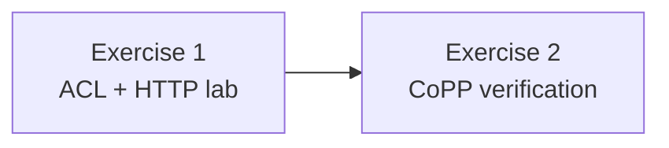

# Cisco 8000 SONiC — L4 ACL & CoPP Lab Guide

> **Scope** · Cisco **8000** · SONiC · **Ingress ACL** (ICMP permit, TCP **dport 80** drop) · **CoPP** read-only verification

**Hands-on** L4-aware **ingress ACL** configuration and **read-only CoPP** checks—structured for **training**, **acceptance testing**, and **operator runbooks**.

| Track | What you build / verify | Primary artifacts |
|:-----:|-------------------------|---------------------|
| **1** | **L3-type** ingress ACL on **Ethernet0** — **`IP_PROTOCOL`**, **`L4_DST_PORT`**, **`PACKET_ACTION`** | **`acl_L4.json`**, **`show acl`**, **`aclshow`**, **`counterpoll`**, **`sudo show platform npu acl`**, optional **Redis** **`ACL_RULE`** |
| **2** | CoPP path from **seed** to **STATE_DB** | **`copp_cfg.json`**, **swss** / **orchagent** / **coppmgrd**, **APPL_DB** **`COPP_TABLE`**, **`swss.rec`**, **`COPP_GROUP_TABLE`** |

> **Persistence** — After **`config load`**, lab **`ACL_TABLE`** / **`ACL_RULE`** usually land in **`/etc/sonic/config_db.json`** and survive **`config reload`** / **reboot** until removed (**`vi`**, **`config`**, or approved tooling). Plan ACL retirement in your environment if you must not keep **`ACL_DENY`** on **Ethernet0**.

**Conventions:** Each exercise flows **objectives → prerequisites → commands → sample output → checklists**. Prompts show **`admin@…`**; use **`sudo`** where indicated.

---

## Table of contents

| # | Section |
|:-:|---------|
| 1 | [Learning objectives](#learning-objectives) |
| 2 | [Lab environment and shared prerequisites](#lab-environment-and-shared-prerequisites) |
| 3 | [Guide flow (recommended order)](#guide-flow-recommended-order) |
| 4 | [Exercise 1 — L4 ingress ACL (HTTP) and verification](#exercise-1--l4-ingress-acl-http-and-verification) — *Example 1 (L4 HTTP)* |
| 5 | [Exercise 2 — CoPP: verification](#exercise-2--copp-verification) — *Verification Steps 1–5, troubleshooting, checklist* |
| 6 | [Appendix — CoPP vs L3 ACL](#appendix--copp-vs-l3-acl-operational-distinction) |

---

## Guide flow (recommended order)

| Step | Phase | Outcome |
|:---:|:---|:---|
| **1** | **Exercise 1** | Baseline **HTTP** → **`config load`** **`acl_L4.json`** → verify CLI, counters, NPU (**Redis** optional) |
| **2** | **Exercise 2** | CoPP **Verification Steps 1–5** (read-only): **`copp_cfg.json`**, **swss**, **APPL_DB**, **`swss.rec`**, **STATE_DB** |



---

## Learning objectives

After this lab you should be able to:

| # | Skill |
|:-:|---------|
| 1 | **ACL (Exercise 1):** Author **Config DB** JSON for an **L3-type** **INGRESS** ACL on a port using **`IP_PROTOCOL`**, **`L4_DST_PORT`**, and **`PACKET_ACTION`** (**FORWARD** / **DROP**); **`config load`**; validate with **`show acl`**, **`counterpoll`**, **`aclshow`**, and **`sudo show platform npu acl`**; interpret optional **Redis** **`ACL_RULE`** / **`ACL_RULE_TABLE`** keys. |
| 2 | **ACL:** Prove **HTTP** is blocked while **ICMP** is forwarded using **`show acl`**, **`aclshow`**, and **NPU** views. |
| 3 | **CoPP (Exercise 2):** Explain **`copp_cfg.json`** (**`COPP_TRAP`** → **`COPP_GROUP`**); verify **swss** / **orchagent** / **coppmgrd**; read **APPL_DB** **`COPP_TABLE`**, **`swss.rec`**, and **STATE_DB** **`COPP_GROUP_TABLE`** against the seed. |

---

## Lab environment and shared prerequisites

| Item | Detail |
|------|--------|
| **Platform** | SONiC on **Cisco 8000** |
| **Access** | Operator with **sudo**; CoPP steps use **`docker exec`** into **swss** where noted |
| **Change vs read-only** | **Exercise 1** **writes** **CONFIG_DB** via **`config load`**. **Exercise 2** **Verification Steps 1–5** are **read-only** (no CoPP policy edits in this guide) |
| **Outputs** | Samples show **shape** only — hostnames, times, PIDs, **Redis** DB numbers, **ACL IDs**, and **orchagent** args differ by image |

---

## Exercise 1 — L4 ingress ACL (HTTP) and verification

| Role | In this capture |
|:-----|:-----------------|
| **ACL leaf** | **pod8-leaf3** · **`Ethernet0`** ingress bind |
| **Client** | **pod8-leaf1** · **`curl`** → **3.4.1.3:80** |
| **Your lab** | Adjust hostnames and IPs to match **your** topology |

### Objectives

| Example | Goal |
|:-------:|------|
| **1** | On **Ethernet0** **INGRESS**: **`FORWARD`** ICMP (**`IP_PROTOCOL`** = **1**, any IPv4 **SRC/DST**); **`DROP`** TCP **dport 80** (**HTTP**). Prove in **`show acl`**, **`aclshow`** / **`counterpoll`**, **`sudo show platform npu acl`**, optional **Redis**. |

> **Before `config load`** — On the ACL leaf: **`show acl table`** · **`show acl rule`**. If **`ACL_DENY`** (or any other ingress ACL on **Ethernet0**) exists, clear it via **your runbook** so **`acl_L4.json`** merges cleanly.

Each subsection: **why** the step matters, then bullets before code blocks for **what** the command shows.

---

### Example 1 — L4 TCP destination port 80 (HTTP)

This example uses the **L3** ACL **table type** on **Ethernet0** (**pod8-leaf3** in the capture) but matches **IP protocol** and **TCP destination port 80**. A **higher-priority** rule (**`PRIORITY`** **10**) **forwards ICMP** so echo/traceroute-style traffic can still work; a **lower-priority** rule (**20**) **drops TCP** to port **80** so HTTP clients time out. In SONiC, **lower numeric `PRIORITY`** is **higher precedence** in typical **`show acl rule`** ordering.

#### Topology and traffic (reference)

| Role | Host (capture) | Action |
|------|----------------|--------|
| **ACL leaf** | **pod8-leaf3** | After baseline, apply **`/tmp/acl_L4.json`** (**`Ethernet0`** ingress bind in capture) |
| **HTTP client** | **pod8-leaf1** | `curl http://3.4.1.3:80` (and `curl -v --connect-timeout 3 …` for verbose timeout proof) |
| **HTTP server** | **3.4.1.3** | `sudo python3 -m http.server 80 --bind 3.4.1.3` on the device that owns **3.4.1.3** |

Run the steps **in order**: first prove **HTTP** works with **no L4 ACL** (server on **3.4.1.3**, **curl** from **Leaf1**). Then load **`acl_L4.json`** on the ACL leaf and show that **TCP port 80** is **dropped** while **ICMP** stays **FORWARD**.

#### Baseline — start server and confirm HTTP (before `acl_L4.json`)

On **pod8-leaf3** (the capture uses the host that owns **3.4.1.3**), start **SimpleHTTP** bound to **3.4.1.3** port **80**:

```bash
sudo python3 -m http.server 80 --bind 3.4.1.3
```

**Output:**

```text
Serving HTTP on 3.4.1.3 port 80 (http://3.4.1.3:80/) ...
```

On **pod8-leaf1**, verbose **curl** — expect **Connected**, **HTTP/1.0 200 OK**, and the directory listing:

```bash
curl -v --connect-timeout 3 http://3.4.1.3
```

**Output:**

```text
*   Trying 3.4.1.3:80...
* Connected to 3.4.1.3 (3.4.1.3) port 80 (#0)
> GET / HTTP/1.1
> Host: 3.4.1.3
> User-Agent: curl/7.88.1
> Accept: */*
>
* HTTP 1.0, assume close after body
< HTTP/1.0 200 OK
< Server: SimpleHTTP/0.6 Python/3.11.2
< Date: Tue, 21 Apr 2026 00:12:02 GMT
< Content-type: text/html; charset=utf-8
< Content-Length: 524
<
<!DOCTYPE HTML>
<html lang="en">
<head>
<meta charset="utf-8">
<title>Directory listing for /</title>
</head>
<body>
<h1>Directory listing for /</h1>
<hr>
<ul>
<li><a href=".bash_history">.bash_history</a></li>
<li><a href=".bash_logout">.bash_logout</a></li>
<li><a href=".bashrc">.bashrc</a></li>
<li><a href=".lesshst">.lesshst</a></li>
<li><a href=".profile">.profile</a></li>
<li><a href=".sudo_as_admin_successful">.sudo_as_admin_successful</a></li>
<li><a href=".viminfo">.viminfo</a></li>
</ul>
<hr>
</body>
</html>
* Closing connection 0
```

On **pod8-leaf1**, plain **curl** (HTML body only):

```bash
curl http://3.4.1.3:80
```

**Output:**

```text
<!DOCTYPE HTML>
<html lang="en">
<head>
<meta charset="utf-8">
<title>Directory listing for /</title>
</head>
<body>
<h1>Directory listing for /</h1>
<hr>
<ul>
<li><a href=".bash_history">.bash_history</a></li>
<li><a href=".bash_logout">.bash_logout</a></li>
<li><a href=".bashrc">.bashrc</a></li>
<li><a href=".lesshst">.lesshst</a></li>
<li><a href=".profile">.profile</a></li>
<li><a href=".sudo_as_admin_successful">.sudo_as_admin_successful</a></li>
<li><a href=".viminfo">.viminfo</a></li>
</ul>
<hr>
</body>
</html>
```

#### ACL JSON (`/tmp/acl_L4.json`)

```bash
cat /tmp/acl_L4.json
```

**File contents:**

```json
{
  "ACL_TABLE": {
    "ACL_DENY": {
      "policy_desc": "ALLOW ICMP, BLOCK HTTP",
      "ports": [
        "Ethernet0"
      ],
      "stage": "INGRESS",
      "type": "L3"
    }
  },
  "ACL_RULE": {
    "ACL_DENY|10-ALLOW-ICMP": {
      "PRIORITY": "10",
      "IP_PROTOCOL": "1",
      "SRC_IP": "0.0.0.0/0",
      "DST_IP": "0.0.0.0/0",
      "PACKET_ACTION": "FORWARD"
    },
    "ACL_DENY|20-DENY-HTTP": {
      "PRIORITY": "20",
      "IP_PROTOCOL": "6",
      "L4_DST_PORT": "80",
      "SRC_IP": "0.0.0.0/0",
      "DST_IP": "0.0.0.0/0",
      "PACKET_ACTION": "DROP"
    }
  }
}
```

**Field summary:**

| Key | Meaning in this lab |
|-----|---------------------|
| **`IP_PROTOCOL`** | **`1`** = ICMP (rule permits it). **`6`** = TCP (rule matches HTTP transport). |
| **`L4_DST_PORT`** | **`80`** = match TCP **destination** port HTTP. |
| **`SRC_IP` / `DST_IP`** | **`0.0.0.0/0`** = any IPv4 address (narrow further if your policy requires). |
| **`PACKET_ACTION`** | **`FORWARD`** = do not drop for that match at this ACL stage; **`DROP`** = discard. |

#### Apply ACL and verify in SONiC CLI

On **pod8-leaf3** (ACL leaf), merge **`acl_L4.json`** into **CONFIG DB**, then confirm tables and rules:

```bash
sudo config load /tmp/acl_L4.json -y
```

**Output:**

```text
Running command: /usr/local/bin/sonic-cfggen -j /tmp/acl_L4.json --write-to-db
```

```bash
show acl rule
```

**Output:**

```text
Table     Rule           Priority    Action    Match              Status
--------  -------------  ----------  --------  -----------------  --------
ACL_DENY  20-DENY-HTTP   20          DROP      DST_IP: 0.0.0.0/0  Active
                                               IP_PROTOCOL: 6
                                               L4_DST_PORT: 80
                                               SRC_IP: 0.0.0.0/0
ACL_DENY  10-ALLOW-ICMP  10          FORWARD   DST_IP: 0.0.0.0/0  Active
                                               IP_PROTOCOL: 1
                                               SRC_IP: 0.0.0.0/0
```

```bash
show acl table
```

**Output:**

```text
Name      Type    Binding    Description             Stage    Status
--------  ------  ---------  ----------------------  -------  --------
ACL_DENY  L3      Ethernet0  ALLOW ICMP, BLOCK HTTP  ingress  Active
```

**Redis (`redis-cli`) verification:** On the ACL leaf, inspect **CONFIG_DB** (Redis DB **4**) for the **`ACL_RULE`** hashes and **STATE_DB** (Redis DB **6**) for **`ACL_RULE_TABLE`** status. That ties the **`show acl table`** / **`show acl rule`** view to what **CONFIG_DB** and **STATE_DB** hold for the same table and rule names.

```bash
redis-cli -n 4 hgetall "ACL_RULE|ACL_DENY|20-DENY-HTTP"
redis-cli -n 4 hgetall "ACL_RULE|ACL_DENY|10-ALLOW-ICMP"
redis-cli -n 6 hgetall "ACL_RULE_TABLE|ACL_DENY|20-DENY-HTTP"
redis-cli -n 6 hgetall "ACL_RULE_TABLE|ACL_DENY|10-ALLOW-ICMP"
```

**Output:**

```text
admin@pod8-leaf3:~$ redis-cli -n 4 hgetall "ACL_RULE|ACL_DENY|20-DENY-HTTP"
 1) "DST_IP"
 2) "0.0.0.0/0"
 3) "IP_PROTOCOL"
 4) "6"
 5) "L4_DST_PORT"
 6) "80"
 7) "PACKET_ACTION"
 8) "DROP"
 9) "PRIORITY"
10) "20"
11) "SRC_IP"
12) "0.0.0.0/0"
admin@pod8-leaf3:~$ redis-cli -n 4 hgetall "ACL_RULE|ACL_DENY|10-ALLOW-ICMP"
 1) "DST_IP"
 2) "0.0.0.0/0"
 3) "IP_PROTOCOL"
 4) "1"
 5) "PACKET_ACTION"
 6) "FORWARD"
 7) "PRIORITY"
 8) "10"
 9) "SRC_IP"
10) "0.0.0.0/0"
admin@pod8-leaf3:~$ redis-cli -n 6 hgetall "ACL_RULE_TABLE|ACL_DENY|20-DENY-HTTP"
1) "status"
2) "Active"
admin@pod8-leaf3:~$ redis-cli -n 6 hgetall "ACL_RULE_TABLE|ACL_DENY|10-ALLOW-ICMP"
1) "status"
2) "Active"
```

#### After ACL — HTTP blocked (same `curl` from Leaf1)

With **`acl_L4.json`** applied on the **ACL leaf**, repeat **`curl`** from **pod8-leaf1**. TCP to port **80** should not complete; **`curl`** reports a timeout:

```bash
curl -v --connect-timeout 3 http://3.4.1.3:80
```

**Output:**

```text
*   Trying 3.4.1.3:80...
* ipv4 connect timeout after 3000ms, move on!
* Failed to connect to 3.4.1.3 port 80 after 3000 ms: Timeout was reached
curl: (28) Failed to connect to 3.4.1.3 port 80 after 3000 ms: Timeout was reached
```

#### ACL counters

While **TCP** attempts to **3.4.1.3:80** keep hitting the ACL, **`PACKETS COUNT`** and **`BYTES COUNT`** for **`20-DENY-HTTP`** **rise over time**. **`counterpoll`** updates ACL statistics on an interval (often **10 s** in the capture), so running **`aclshow -t ACL_DENY`** **several times in a row**—or leaving a client **retrying** in the background—shows the counts **stair-step upward** (for example **9 → 10 → 11 → 12** packets) as drops accumulate.

```bash
counterpoll show | grep ACL
```

**Output:**

```text
ACL                         10000               enable
```

```bash
aclshow -c
aclshow
aclshow -t ACL_DENY
```

**Example (`aclshow -t ACL_DENY` after several short `curl` attempts):**

```text
RULE NAME     TABLE NAME      PRIO    PACKETS COUNT    BYTES COUNT
------------  ------------  ------  ---------------  -------------
20-DENY-HTTP  ACL_DENY          20               12            936
```

To **sustain** connection attempts from **pod8-leaf1** while you watch counters on **pod8-leaf3**, you can leave **`curl`** running with aggressive retry and no overall time cap (stop with **Ctrl+C** when finished):

```bash
curl --retry 0 --retry-all-errors --connect-timeout 0 --max-time 0 http://3.4.1.3:80
```

On **pod8-leaf3**, run **`aclshow -t ACL_DENY`** repeatedly in another session. **Packet** and **byte** totals increase as long as the client keeps trying **TCP port 80** (each poll or each check may show the same value twice if no new drops arrived between samples—then the next bump appears when new packets are dropped):

```text
admin@pod8-leaf3:~$ aclshow -t ACL_DENY
RULE NAME     TABLE NAME      PRIO    PACKETS COUNT    BYTES COUNT
------------  ------------  ------  ---------------  -------------
20-DENY-HTTP  ACL_DENY          20                9            702
admin@pod8-leaf3:~$ aclshow -t ACL_DENY
RULE NAME     TABLE NAME      PRIO    PACKETS COUNT    BYTES COUNT
------------  ------------  ------  ---------------  -------------
20-DENY-HTTP  ACL_DENY          20               10            780
admin@pod8-leaf3:~$ aclshow -t ACL_DENY
RULE NAME     TABLE NAME      PRIO    PACKETS COUNT    BYTES COUNT
------------  ------------  ------  ---------------  -------------
20-DENY-HTTP  ACL_DENY          20               10            780
admin@pod8-leaf3:~$ aclshow -t ACL_DENY
RULE NAME     TABLE NAME      PRIO    PACKETS COUNT    BYTES COUNT
------------  ------------  ------  ---------------  -------------
20-DENY-HTTP  ACL_DENY          20               11            858
admin@pod8-leaf3:~$ aclshow -t ACL_DENY
RULE NAME     TABLE NAME      PRIO    PACKETS COUNT    BYTES COUNT
------------  ------------  ------  ---------------  -------------
20-DENY-HTTP  ACL_DENY          20               11            858
admin@pod8-leaf3:~$ aclshow -t ACL_DENY
RULE NAME     TABLE NAME      PRIO    PACKETS COUNT    BYTES COUNT
------------  ------------  ------  ---------------  -------------
20-DENY-HTTP  ACL_DENY          20               11            858
admin@pod8-leaf3:~$ aclshow -t ACL_DENY
RULE NAME     TABLE NAME      PRIO    PACKETS COUNT    BYTES COUNT
------------  ------------  ------  ---------------  -------------
20-DENY-HTTP  ACL_DENY          20               12            936
```

> **Note:** Only **`20-DENY-HTTP`** accumulates drops for this test; **`10-ALLOW-ICMP`** does not increment for TCP.

#### NPU / ASIC view (Cisco 8000)

```bash
sudo show platform npu acl summary
```

**Output (ACE table excerpt — TCP destination port 80 and ICMP):**

```text
 +--------+----------+-------------+-----------------+-----------------+-------------+------+
 | ACL ID | Position | PROTOCOL(F) |   IPV4_SIP(F)   |   IPV4_DIP(F)   |   DPORT(F)  | (C)  |
 +--------+----------+-------------+-----------------+-----------------+-------------+------+
 | 10483  |    0     |    6/255    | 0.0.0.0/0.0.0.0 | 0.0.0.0/0.0.0.0 | 0x50/0xffff | True |
 | 10483  |    1     |    1/255    | 0.0.0.0/0.0.0.0 | 0.0.0.0/0.0.0.0 |             |      |
 +--------+----------+-------------+-----------------+-----------------+-------------+------+
```

**`0x50`** is hexadecimal for decimal **80** (HTTP). **ACL ID** and **ACE Number** are examples from the capture—read the live values from **`sudo show platform npu acl summary`** on your switch.

```bash
sudo show platform npu acl ace -a 10483 -p 0
sudo show platform npu acl ace -a 10483 -p 1
```

**Output (`-p 0` — TCP port 80 match):**

```text
 | ACL ID | Position | PROTOCOL(F) |   IPV4_SIP(F)   |   IPV4_DIP(F)   |   DPORT(F)  | (C)  |
 | 10483  |    0     |    6/255    | 0.0.0.0/0.0.0.0 | 0.0.0.0/0.0.0.0 | 0x50/0xffff | True |
```

**Output (`-p 1` — ICMP permit):**

```text
 | ACL ID | Position | PROTOCOL(F) |   IPV4_SIP(F)   |   IPV4_DIP(F)   |
 | 10483  |    1     |    1/255    | 0.0.0.0/0.0.0.0 | 0.0.0.0/0.0.0.0 |
```

### Example 1 — Verification checklist

- [ ] **`show acl rule`** — **10-ALLOW-ICMP** (**FORWARD**, **IP_PROTOCOL** 1) and **20-DENY-HTTP** (**DROP**, **IP_PROTOCOL** 6, **L4_DST_PORT** 80), both **Active**
- [ ] **`show acl table`** — **ACL_DENY** on **Ethernet0**, description **ALLOW ICMP, BLOCK HTTP**
- [ ] **Leaf1** **`curl http://3.4.1.3:80`** times out after ACL apply; **`aclshow -t ACL_DENY`** shows **20-DENY-HTTP** hits climbing (retry with **`curl --retry 0 --retry-all-errors --connect-timeout 0 --max-time 0 …`** if needed)
- [ ] **`sudo show platform npu acl summary`** / **`ace`** — **PROTOCOL** / **DPORT** match TCP **80** + **ICMP** at ACE positions **0** / **1** for **your** **ACL ID**

---

## Exercise 2 — CoPP: verification

### Objectives

- Trace **seed CoPP** → **SWSS** → **APPL_DB** **`COPP_TABLE`** → **`swss.rec`** → **STATE_DB** **`COPP_GROUP_TABLE`**.
- Keep **Verification Steps 1–5** as **read-only** inspection; **policy** edits stay in your **change process**.

**Use this track when** · post-**install** / **upgrade** · **CONFIG_DB** touched CoPP · **control-plane** symptoms (**BGP** churn, neighbor loss, high punt CPU).

**Read once** · **CoPP theory** (below) for **`copp_cfg.json`**, **`default`** group, **trap vs copy**, **SR_TCM**, Q200-style trap map. **Samples** show **shape** only—compare live output to **`cat /etc/sonic/copp_cfg.json`** on **this** device (**PIDs**, **Redis DB indices**, **MAC** args differ by image).

Each **Verification Step**: **Why** first, then bullets + code for **what** it proves.

---

### Prerequisites

- **Platform:** SONiC on **Cisco 8000** with **`show feature`**, **`redis-cli`** (and preferably **`sonic-db-cli`** per your runbook).
- **Access:** Operator account with **`docker exec`** into the **swss** container (read-only checks inside SWSS).
- **Change window:** **Verification Steps 1–5** are **non-disruptive** (read-only inspection). Incorrect CoPP changes made outside this guide can still drop **BGP**, **LACP**, or **ARP** to the CPU path—follow your release documentation when editing policy.

---

### What CoPP does (one paragraph)

CoPP maps **ASIC trap classes** (BGP, LACP, ARP, LLDP, packets to local IPs, and so on) to **policer parameters** (CIR/CBS), **CPU queue**, **trap vs copy**, and **priority**. The goal is to **protect the control plane** from floods while keeping protocols stable. This is **not** the same as a front-panel **L3 ACL** on data-plane traffic.

---

### CoPP theory — configuration model and default behavior

This section explains **how SONiC expresses CoPP policy in JSON**, how **groups** relate to **traps**, what the **`default`** group is for, and how to read the **Cisco SONiC / Q200-style** defaults shipped under **`/etc/sonic/copp_cfg.json`**. Use it as **background** before executing the verification procedure.

#### Policy file and the two top-level objects

On SONiC, baseline CoPP is commonly seeded from **`/etc/sonic/copp_cfg.json`**. That file has two cooperating parts:

1. **`COPP_GROUP`** — Defines **named buckets** of behavior: how packets are **trapped or copied**, which **CPU queue** they use, and how they are **metered** (policer type, mode, CIR/CBS, exceed action). Think of a group as **“how the ASIC should treat this class of CPU-bound packets.”**
2. **`COPP_TRAP`** — Maps **protocol-oriented trap entries** to a **`trap_group`** (the name of a **`COPP_GROUP`**). Each trap entry lists one or more **`trap_ids`** (ASIC-level trap identifiers such as **`bgp`**, **`lacp`**, **`arp_req`**). Those IDs are the **control-plane packet types** the policer and queue logic attach to.

**End-to-end mental model:** *Trap IDs* (what the packet **is**) → *COPP_TRAP row* (which **group** it joins) → *COPP_GROUP* ( **trap vs copy**, **queue**, **CIR/CBS**, **drop on red**).

#### The `default` group (catch-all for “other” CPU traffic)

The group named **`default`** defines how **control-plane traffic that does not match any `trap_ids` wired through `COPP_TRAP`** is handled. In other words, if a packet is **destined for the CPU** (punted/trapped by the ASIC) but **does not** correspond to an explicit trap mapping such as BGP, LACP, ARP, LLDP, and so on, it falls under **`default`**.

On many images the **`default`** object specifies metering (**`cir`**, **`cbs`**), **`meter_type`**, **`mode`**, **`queue`**, and **`red_action`**. Some builds also set **`trap_action`** explicitly on **`default`**; others rely on implicit trap behavior. Always **`cat`** the file on **your** image rather than assuming optional keys.

Typical **`default`** intent: a **moderate** policer on **queue 0** so miscellaneous punt traffic cannot starve well-known protocols that have their own, tighter or looser, groups.

#### Default `COPP_TRAP` names on Cisco SONiC (reference list)

The seed JSON discussed in this guide defines named traps such as **`bgp`**, **`lacp`**, **`arp`**, **`lldp`**, **`dhcp_relay`**, **`udld`**, **`ip2me`**, **`macsec`**, **`nat`**, and **`sflow`**. These are **policy containers**: the real ASIC programming uses the **`trap_ids`** strings inside each container. Your platform may add or omit traps by feature; treat this list as the **Q200 reference baseline**, not a guarantee on every SKU or branch.

A **Q200-style** excerpt of **`COPP_GROUP`** / **`COPP_TRAP`** appears under **Verification Step 1 — Confirm seed policy on disk** (truncated **Reference output** for `cat /etc/sonic/copp_cfg.json`; the full file is on the device). Use that block as the structural baseline; your on-switch file may differ slightly (for example the **`default`** object may include **`trap_action`**).

#### Protocol-by-protocol reading of the default map

Each **`COPP_TRAP`** row points at one **`trap_group`**. **Multiple trap names can share one group**, which means they **share one policer instance** after coppmgr merges them (see **`swss.rec`** / **`COPP_TABLE`** in **Verification Steps 3 and 4**). The table below summarizes the **intent** of the Q200 defaults.

| Named trap | `trap_ids` (ASIC classes) | `trap_group` | CPU queue (from group) | Policer (packets) | Notes |
|------------|---------------------------|--------------|-------------------------|-------------------|--------|
| **bgp** | `bgp`, `bgpv6` | `queue4_group1` | 4 | CIR **6000**, CBS **6000** | **`trap_action: trap`** — punt to CPU for the routing stack; excess **dropped** by **`red_action: drop`**. |
| **lacp** | `lacp` | `queue4_group1` | 4 | same as BGP | Shares **queue4_group1** meter with BGP/MACsec traps that land in the same merged group. **`always_enabled: true`**. |
| **arp** | `arp_req`, `arp_resp`, `neigh_discovery` | `queue4_group2` | 4 | CIR **600**, CBS **600** | **`trap_action: copy`** — a **copy** is delivered to the CPU path for neighbor learning while the **original** can still follow normal **bridging/L3 forwarding** semantics where the ASIC supports it. **`always_enabled: true`**. |
| **lldp** | `lldp` | `queue4_group3` | 4 | CIR **100**, CBS **100** | Tight policer; often merged with UDLD/DHCP in APPL_DB as one row. |
| **dhcp_relay** | `dhcp`, `dhcpv6` | `queue4_group3` | 4 | same as LLDP | Same group as LLDP/UDLD → **shared** 100 pps budget in the seed. |
| **udld** | `udld` | `queue4_group3` | 4 | same | **`always_enabled: true`**. |
| **ip2me** | `ip2me` | `queue1_group1` | 1 | CIR **6000**, CBS **6000** | **Packets destined to the switch’s own IP addresses** (my-ip exception path). High budget relative to discovery protocols. **`always_enabled: true`**. |
| **macsec** | `eapol` | `queue4_group1` | 4 | same as BGP | 802.1X **EAPoL** to CPU; shares **queue4_group1** with BGP/LACP. |
| **nat** | `src_nat_miss`, `dest_nat_miss` | `queue1_group2` | 1 | CIR **600**, CBS **600** | NAT **miss** traps toward control plane; separate from **ip2me**’s higher tier. |
| **sflow** | `sample_packet` | `queue2_group1` | 2 | CIR **1000**, CBS **1000** | Sampling path; includes **`genetlink_name` / `genetlink_mcgrp_name`** for **psample**-style delivery toward the kernel/user sampling pipeline. |

**Takeaway:** **Queue 4** carries much of **L2/L3 control adjacency** (BGP, LACP, MACsec, ARP copy). **Queue 1** splits **“my IP”** (**ip2me**, high) from **NAT miss** (lower). **Queue 2** is reserved for **sFlow**-like sampling in this profile.

#### `COPP_GROUP` parameters (theory)

| Parameter | Meaning |
|-----------|--------|
| **`trap_action`** | **`trap`** — Intercept the packet and send it on the **CPU / punt** path; it does **not** continue as normal forwarded data-plane traffic in the pure-trap case. Use for protocols the **switch must terminate** (for example BGP updates to **local** BGP). **`copy`** — The ASIC **duplicates** the packet: one copy to the CPU for **protocol or learning** logic, while the **original** can still be **forwarded** where hardware and SAI semantics allow. This pattern is **common for ARP/ND** so the CPU can learn neighbors without necessarily swallowing the only copy. Exact behavior is **SAI/ASIC-specific**; validate on your release if you rely on copy semantics. |
| **`trap_priority`** | Numeric **priority among traps** at the ASIC. Higher values usually mean **more urgent** handling when multiple traps compete; treat the number as **vendor-relative**, not portable across unrelated chips. |
| **`queue`** | **CPU queue index** after trap/copy. Linux/HSQM scheduling can give **different scheduling weights** per queue so **BGP/LACP** can be isolated from **LLDP** floods. |
| **`meter_type`** | **`packets`** — **`cir`** and **`cbs`** count **packets** (not bytes). Some designs support byte meters; this seed uses **packet** policing. |
| **`mode`** | **`sr_tcm`** — **Single Rate Three Color Marker** style policing. Conceptually the meter marks packets **green** (within committed rate), **yellow** (burst use depending on implementation), or **red** (exceeds allowed burst / committed budget). **SONiC + SAI** map these outcomes to **`red_action`**. |
| **`cir`** | **Committed Information Rate** — sustained allowance (here, **packets per second**). |
| **`cbs`** | **Committed Burst Size** — burst allowance in **packets** (paired with **`cir`** for token-bucket behavior). |
| **`red_action`** | **`drop`** — Packets classified as **“red”** (over limit) are **dropped** instead of being sent to the CPU. |
| **`genetlink_name`** / **`genetlink_mcgrp_name`** | Used on **`queue2_group1`** for **sFlow** / **psample** integration so sampled packets can reach the correct **generic netlink** channel in Linux. |

#### `COPP_TRAP` parameters (theory)

| Parameter | Meaning |
|-----------|--------|
| **`trap_ids`** | Comma-separated **ASIC trap identifiers** installed under this named trap. |
| **`trap_group`** | Name of a **`COPP_GROUP`** entry: inherits **`trap_action`**, **`queue`**, **`cir`**, **`cbs`**, and related fields. |
| **`always_enabled`** | When **`true`**, SONiC should keep this trap **active** regardless of whether the high-level feature looks “configured” from the operator’s perspective. Important for **fundamental** protocols (**LACP**, **ARP/ND**, **UDLD**, **ip2me**) so the ASIC still punts required packet types during bring-up. This key lives on **`COPP_TRAP`** rows in JSON (not inside **`COPP_GROUP`**). |

#### Design notes operators care about

- **Shared policers:** Traps that reference the **same** `trap_group` name share **one** policer after merge (for example **LLDP + DHCP relay + UDLD** all on **`queue4_group3`** → one **100 pps** budget in the seed). Raising CIR for “LLDP only” without splitting groups requires a **config model** change, not a one-line tweak inside the same group.
- **Why ARP uses `copy`:** Neighbor discovery benefits from **CPU visibility** without necessarily blocking **normal forwarding** of the same frame where **copy** semantics apply.
- **Why BGP and LACP share a group:** Both are **wired-speed-sensitive** control protocols on many designs; the **6000 pps** tier reflects a **high-trust** class. Under heavy BGP churn, validate offered **pps** to the CPU against **CIR/CBS** and CoPP drop counters (platform-specific) before changing policy.

---

### Architecture (reference)

| Stage | Artifact | Role |
|--------|-----------|------|
| Seed | **`/etc/sonic/copp_cfg.json`** | Default **`COPP_GROUP`** + **`COPP_TRAP`** template shipped with the image. |
| Persistent config | **`/etc/sonic/config_db.json`** (if present) | May override or extend CoPP; empty/missing CoPP keys often mean the seed applies. |
| Effective policy | **CONFIG_DB** (Redis) | What **coppmgrd** reconciles after merges and feature state. |
| Orch input | **APPL_DB** `COPP_TABLE:<group>` | What **orchagent** programs via **SAI**. On many images **`redis-cli -n 0`** is **APPL_DB**—**confirm** with **`sonic-db-cli`** / platform documentation before scripting. |
| Runtime status | **STATE_DB** `COPP_GROUP_TABLE|…` | Operational state such as **`state: ok`**. **STATE_DB** Redis index varies by release (**`-n 6`** in the reference capture)—**verify** on target software. |

Daemons:

- **`coppmgrd`** — CoPP manager: CONFIG_DB → policy toward orchestration.
- **`orchagent`** — Contains **COPP orchestration** path that programs the ASIC through **syncd** / vendor **SAI**.

---

### Verification Step 1 — Confirm seed policy on disk

**Why:** Verification starts from the **authoritative seed** merged into CONFIG_DB. You record **CIR/CBS**, **queues**, **trap_action**, and **which trap_ids share a group** so later Redis checks have a baseline.

- **`cat /etc/sonic/copp_cfg.json`** — Displays the image **CoPP baseline** (compare merged **`trap_ids`** and policer fields against **Verification Steps 3 and 4**).

```bash
cat /etc/sonic/copp_cfg.json
```

**Reference output (truncated excerpt; must match your image version):** Only a subset of **`COPP_GROUP`** and **`COPP_TRAP`** entries are shown below. Run **`cat /etc/sonic/copp_cfg.json`** on the switch for the **full** policy.

```json
{
    "COPP_GROUP": {
            "default": {
                    "trap_action":"trap",
                    "queue": "0",
                    "meter_type":"packets",
                    "mode":"sr_tcm",
                    "cir":"600",
                    "cbs":"600",
                    "red_action":"drop"
            },
            "queue4_group1": {
                    "trap_action":"trap",
                    "trap_priority":"4",
                    "queue": "4",
                    "meter_type":"packets",
                    "mode":"sr_tcm",
                    "cir":"6000",
                    "cbs":"6000",
                    "red_action":"drop"
            },
            "queue4_group2": {
                    "trap_action":"copy",
                    "trap_priority":"4",
                    "queue": "4",
                    "meter_type":"packets",
                    "mode":"sr_tcm",
                    "cir":"600",
                    "cbs":"600",
                    "red_action":"drop"
            }
    },
    "COPP_TRAP": {
            "bgp": {
                    "trap_ids": "bgp,bgpv6",
                    "trap_group": "queue4_group1"
            },
            "lacp": {
                    "trap_ids": "lacp",
                    "trap_group": "queue4_group1",
                    "always_enabled": "true"
            },
            "arp": {
                    "trap_ids": "arp_req,arp_resp,neigh_discovery",
                    "trap_group": "queue4_group2",
                    "always_enabled": "true"
            }
    }
}
```

#### Field reference — `COPP_GROUP`

Each **group** is a **policer + queue + trap behavior** bundle. Multiple **traps** can reference the same group (they then share the meter).

| Field | Meaning |
|--------|--------|
| **`trap_action`** | **`trap`** — send matching control packets to the CPU path. **`copy`** — often used where the ASIC should **copy** samples (e.g. ARP/ND) per vendor/SAI semantics; do not assume identical to **`trap`** on every ASIC without checking behavior in your release notes. |
| **`trap_priority`** | Relative ordering among traps (string numeric in JSON). |
| **`queue`** | CPU **queue index** for this class after trapping. |
| **`meter_type`** | **`packets`** here — policer counts **packets** (not bytes). |
| **`mode`** | **`sr_tcm`** — single-rate three-color marker style token bucket (committed/excess semantics; **`red_action`** defines exceed behavior). |
| **`cir` / `cbs`** | **Committed information rate** (packets/sec in this file) and **committed burst** (packets). Excess is subject to **`red_action`**. |
| **`red_action`** | **`drop`** — drop on exceed (policing). |
| **`genetlink_name` / `genetlink_mcgrp_name`** | Present on **`queue2_group1`** for **sFlow** / **psample** style sampling toward user space; typical for **sample_packet** path. |

#### Field reference — `COPP_TRAP`

Each entry names a **feature-facing trap bucket** and points at a **`trap_group`**.

| Field | Meaning |
|--------|--------|
| **`trap_ids`** | Comma-separated **ASIC trap identifiers** installed under this policy (e.g. **`bgp,bgpv6`**). |
| **`trap_group`** | Name of a **`COPP_GROUP`** entry: inherits CIR/CBS/queue/action. |
| **`always_enabled`** | When **`true`**, trap should stay enabled irrespective of certain feature toggles (image-dependent; treat as **hint** to read coppmgrd / CONFIG_DB behavior for your branch). |

**Operational note — shared policers:** In this JSON, **`lldp`** and **`udld`** both use **`queue4_group3`** (CIR/CBS **100**). **`swss.rec`** (**Verification Step 4**) should show a **single** `COPP_TABLE` row for **`queue4_group3`** with merged **`trap_ids`** (for example **`lldp,udld`** plus other members of that group after merge).

---

### Verification Step 2 — Confirm SWSS feature and processes

**Why:** CoPP is applied by **orchagent** under **swss**. If **swss** is disabled or **orchagent** / **coppmgrd** is not running, **APPL_DB** / **STATE_DB** views are **not trustworthy** for hardware parity.

On the **host** (not inside the container), **`show feature`** confirms **swss** is enabled:

```bash
show feature config | grep -E "Feature|swss"
```

**Output:**

```text
Feature         State            AutoRestart     Owner
swss            enabled          enabled         local
```

```bash
show feature status | grep -E "Feature|swss"
```

**Output:**

```text
Feature         State            AutoRestart     SetOwner
swss            enabled          enabled
```

Inside **SWSS** (orchagent and coppmgrd run here):

- **`docker exec -it swss bash`** — Opens a shell in the **swss** container.
- **`ps -eaf | grep -E 'coppmgrd|orchagent'`** — Shows **coppmgrd** and **orchagent** PIDs and arguments.

```bash
docker exec -it swss bash
ps -eaf | grep -E 'coppmgrd|orchagent'
```

**Output:**

```text
root          59       1  0 06:03 pts/0    00:00:44 /usr/bin/orchagent -d /var/log/swss -t 300-b 1024 -s -m 78:CA:F8:BB:A0:00
root          85       1  0 06:03 pts/0    00:00:03 /usr/bin/coppmgrd
```

- **`supervisorctl status`** — Confirms **supervisord** believes the processes are **RUNNING**.

```bash
supervisorctl status | grep -E 'orchagent|coppmgrd'
```

**Output:**

```text
coppmgrd                         RUNNING   pid 85, uptime 12:52:45
orchagent                        RUNNING   pid 59, uptime 12:52:47
```

**Note:** `show` is a **host** CLI. Inside the **swss** container it may be missing (`bash: show: command not found`); exit with **`exit`** and run **`show …`** on the switch Linux host.

#### Paste safety (optional but important)

If the shell prints **`bash: $'\342\200\213': command not found`** before a valid line, the prompt or paste likely contains a **Unicode zero-width space (U+200B)**. Retype the command in a plain-text terminal or paste from a raw snippet; invisible characters are not valid commands.

---

### Verification Step 3 — APPL_DB `COPP_TABLE` (what orchagent consumed)

**Why:** **`COPP_TABLE`** in **APPL_DB** is the flattened **group** view with **`trap_ids`** attached. This is the primary check that **coppmgrd** merged traps correctly and that **CIR/CBS/queue/trap_action** match the intended policy before it reaches **SAI**.

On the **device under verification**, query **APPL_DB** (below uses **`redis-cli -n 0`** where that maps to **APPL_DB** on your image—**confirm** before automation):

```bash
redis-cli -n 0 hgetall "COPP_TABLE:queue4_group1"
```

**Output:**

```text
 1) "cbs"
 2) "6000"
 3) "cir"
 4) "6000"
 5) "meter_type"
 6) "packets"
 7) "mode"
 8) "sr_tcm"
 9) "queue"
10) "4"
11) "red_action"
12) "drop"
13) "trap_action"
14) "trap"
15) "trap_priority"
16) "4"
17) "trap_ids"
18) "bgp,bgpv6,lacp"
```

Spot-check a single field:

```bash
redis-cli -n 0 hget "COPP_TABLE:queue4_group1" "cir"
```

**Output:**

```text
"6000"
```

> **Note:** Redis **DB index** mapping (**0** for APPL_DB and **6** for STATE_DB in the reference capture) **varies by SONiC branch**. For automated scripts, use **`sonic-db-cli`** with logical database names where supported.

---

### Verification Step 4 — Correlate with `swss.rec` (time-ordered orch trace)

**Why:** **`/var/log/swss/swss.rec`** records **SET** operations on orch-facing tables. It provides a **time-ordered audit trail** of when CoPP rows were pushed and **which field set** orchagent last applied—useful after **reload**, **swss restart**, or **incident** correlation.

```bash
grep -i copp /var/log/swss/swss.rec
```

**Reference output (abbreviated; timestamps and ordering from your device):**

```text
2026-04-20.05:27:08.821817|COPP_TABLE:queue4_group3|SET|cbs:100|cir:100|meter_type:packets|mode:sr_tcm|queue:4|red_action:drop|trap_action:trap|trap_priority:4|trap_ids:lldp,udld
2026-04-20.05:27:08.821882|COPP_TABLE:queue1_group1|SET|cbs:6000|cir:6000|meter_type:packets|mode:sr_tcm|queue:1|red_action:drop|trap_action:trap|trap_priority:1|trap_ids:ip2me
2026-04-20.05:27:08.821889|COPP_TABLE:queue4_group1|SET|cbs:6000|cir:6000|meter_type:packets|mode:sr_tcm|queue:4|red_action:drop|trap_action:trap|trap_priority:4|trap_ids:bgp,bgpv6,lacp
2026-04-20.05:27:08.821915|COPP_TABLE:queue4_group2|SET|cbs:600|cir:600|meter_type:packets|mode:sr_tcm|queue:4|red_action:drop|trap_action:copy|trap_priority:4|trap_ids:arp_req,arp_resp,neigh_discovery
2026-04-20.05:27:08.821922|COPP_TABLE:default|SET|cbs:600|cir:600|meter_type:packets|mode:sr_tcm|queue:0|red_action:drop|trap_action:trap
```

You may see **duplicate** `SET` lines after restarts or reprogramming (second block in the capture around **06:05**); that is normal when SWSS replays policy.

---

### Verification Step 5 — STATE_DB `COPP_GROUP_TABLE` (operational state)

**Why:** **STATE_DB** exposes **orchestration / hardware sync** status for CoPP groups. A healthy **`state`** (commonly **`ok`**) is a **binary pass/fail** gate before you conclude verification or escalate to **syncd** / **SAI** logs.

```bash
redis-cli -n 6 hgetall "COPP_GROUP_TABLE|queue4_group1"
```

**Expected shape (on a healthy device):**

```text
1) "state"
2) "ok"
```

If **`state`** is not **`ok`**, use **Troubleshooting** (below) before signing off verification or opening a **CoPP policy** change.

---

### Troubleshooting (short)

| Symptom | Checks |
|---------|--------|
| No **`COPP_TABLE`** rows in APPL_DB | **`show feature status`**, **`supervisorctl status`** inside **swss**, **`grep -i copp swss.rec`**, CONFIG_DB merge errors in **`syslog`**. |
| **`state` not `ok`** in **STATE_DB** | **syncd** / SAI errors in **`/var/log/syslog`** or **`docker logs syncd`**; ASIC resource exhaustion (rare) on heavy custom trap lists. |
| BGP flaps under load | Compare **`queue4_group1`** CIR/CBS with measured **pps** to CPU; any **CIR/CBS** increase follows **change management**, baseline capture, and **post-change** Verification Steps 3–5. |
| ARP/ND issues | Note **`queue4_group2`** uses **`trap_action: copy`** in the seed—verify neighbor learning with **ASIC**/**kernel** tools per TAC guidance if behavior differs from expectation. |

---

### CoPP verification checklist

Run **in order** for **post-change** validation, **upgrade** acceptance, or **incident** sign-off.

- [ ] **Verification Step 1** — **`cat /etc/sonic/copp_cfg.json`**: **`COPP_GROUP`** / **`COPP_TRAP`**, **CIR/CBS**, **queues** match this **image**
- [ ] **Verification Step 2** — **`show feature`**: **swss** **enabled** · **`docker exec -it swss bash`** → **`ps`** / **`supervisorctl`**: **orchagent** + **coppmgrd** **RUNNING**
- [ ] **Verification Step 3** — **APPL_DB** **`COPP_TABLE:<group>`**: matches seed for **`queue4_group1`**, **`queue4_group2`**, **`queue4_group3`**, **`queue1_group1`**, **`default`** (**`trap_ids`**, **cir**, **cbs**, **trap_action**)
- [ ] **Verification Step 4** — **`grep -i copp /var/log/swss/swss.rec`**: **`COPP_TABLE`** **`SET`** lines align with **Verification Step 3** after last **reload** / **swss** event
- [ ] **Verification Step 5** — **STATE_DB** **`COPP_GROUP_TABLE`**: **`state`** healthy (**`ok`** typical) for representative groups; investigate if not

---

## Appendix — CoPP vs L3 ACL (operational distinction)

| Topic | CoPP | L3 ACL (port ACL) |
|-------|------|-------------------|
| **Purpose** | **Protect the CPU** — trap / copy classes (**BGP**, **ARP**, **ip2me**, **sFlow** samples, …). | **Filter data-plane** traffic on **front-panel** ports by match criteria. |
| **Typical tables** | **`COPP_GROUP`**, **`COPP_TRAP`**, APPL **`COPP_TABLE`**. | **`ACL_TABLE`**, **`ACL_RULE`** (Config DB / APPL_DB per feature). |
| **Policy seed** | **`/etc/sonic/copp_cfg.json`** merged into **CONFIG_DB**. | JSON fragments and **`config load`** (image-dependent). |

---

### About the sample output

> **Sample output** — **Exercise 1** counters vary with traffic and timing. **Exercise 2** excerpts reflect **Cisco 8000** SONiC validation runs. **Redis DB indices**, **ACL IDs**, **PIDs**, and **timestamps** differ by branch—**confirm on your device** before sign-off.
